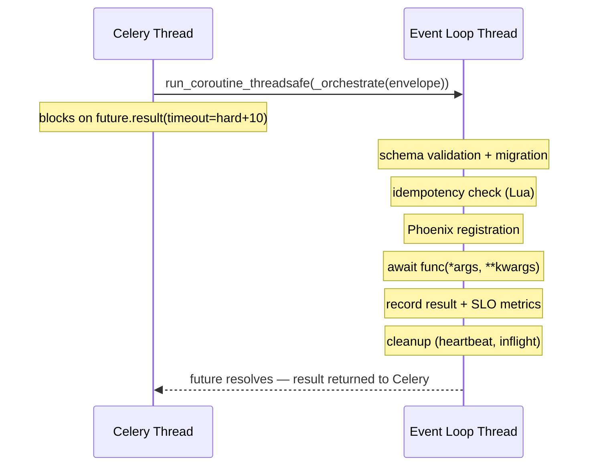

# Architecture

This page is for engineers who want to understand how Relier works under the hood. If you just want to use it, the [Quickstart](quickstart.md) and [Core Concepts](concepts.md) are enough. Come back here when you're debugging something deep or evaluating whether Relier fits your constraints.

---

## The central tension: FastAPI is async, Celery is not

FastAPI is built on asyncio. Your route handlers are `async def`, your database calls are `await`, your entire stack is event-loop-native.

Celery is built on prefork workers, separate OS processes, each running a plain synchronous Python event loop. When Celery calls your task function, it calls it synchronously. If your task is `async def`, Celery has no idea what to do with the returned coroutine object.

Relier's entire async bridge exists to solve this mismatch cleanly.

---

## The Async/Celery Bridge

### The wrong approach: `asyncio.run()` per task

The naive fix is to call `asyncio.run(my_async_task())` inside each task. This works, but it creates and destroys a new event loop and a new Redis connection pool for every single task execution. At any real throughput, this exhausts connection limits and adds significant per-task overhead.

### Relier's approach: one persistent event loop per worker

Each Celery worker process gets **one event loop, created once at startup, reused forever**.

Here's the exact boot sequence:

```
Worker process spawns (via Celery's prefork)
  │
  ├─ init_worker_process() fires (Celery signal hook in app.py)
  │    ├─ asyncio.new_event_loop() — fresh loop, not inherited from parent
  │    ├─ daemon thread started: runs loop.run_forever() in the background
  │    ├─ loop stored in module-level worker_loop variable
  │    ├─ Redis pool pre-warmed: get_relier_redis() called immediately
  │    │   (first task pays zero connection cost)
  │    ├─ Worker presence heartbeat loop started (updates rl:presence:{worker_id} every 5s)
  │    └─ GracefulShutdownHandler installed (SIGTERM/SIGINT → drain)
  │
  └─ Worker is ready to accept tasks
```

### How task execution flows across the thread boundary

When Celery hands a task to the worker, it calls the sync wrapper in the **Celery thread**. That wrapper schedules the async orchestration onto the **event loop thread**:



This is safe because Python's asyncio is not thread-safe at the coroutine level, but `run_coroutine_threadsafe` is explicitly designed for this cross-thread scheduling pattern. The event loop thread owns all async state; the Celery thread only hands work to it and waits.

### Background loops on the worker event loop

Several tasks run concurrently on the worker's event loop in the background:

| Loop | Purpose | Interval |
|------|---------|----------|
| `_presence_loop` | Refreshes `rl:presence:{worker_id}` | `heartbeat_ttl / 2` |
| `PhoenixRegistry._refresh_loop` | Extends `rl:hb:{task_id}` per active task | `heartbeat_ttl / 2` |
| `_cleanup_dead_workers` | Removes stale worker IDs from `rl:workers` | 60s |

These loops coexist on the same event loop as your task execution. They're all `async def` coroutines scheduled via `asyncio.create_task`.

---

## Redis Key Schema

Everything Relier does is in Redis under the `rl:` prefix. Here's the full map:

### Task lifecycle keys

| Key | Type | TTL | Purpose |
|-----|------|-----|---------|
| `rl:hb:{task_id}` | String | `heartbeat_ttl` (10s) | Heartbeat, expiry means the worker is dead |
| `rl:phoenix:{task_id}` | Hash | 24h | Full task state: payload, worker_id, registered_at, partial_result, checksum |
| `rl:resurrections:{task_id}` | String | None | How many times this task has been resurrected |
| `rl:lock:resurrect:{task_id}` | String | 30s | Distributed lock: prevents two resurrectorsre-queuing the same task |
| `rl:lease:{task_id}` | String | 180s | Fence token lease, only the holder may commit this incarnation |
| `rl:fence:{task_id}` | String | 600s | Current incarnation ID, stale workers are rejected on commit |

### Worker tracking keys

| Key | Type | TTL | Purpose |
|-----|------|-----|---------|
| `rl:workers` | SortedSet | None | All workers, scored by last-seen timestamp |
| `rl:presence:{worker_id}` | String | `heartbeat_ttl` (10s) | Ephemeral worker liveness key |
| `rl:inflight:{worker_id}` | SortedSet | None | Task IDs actively running on this worker, scored by start time |

### Reliability keys

| Key | Type | TTL | Purpose |
|-----|------|-----|---------|
| `rl:idem:{name}:{hash}` | String | `idempotency_ttl` | Idempotency cache: `IN_FLIGHT` sentinel or serialised result |
| `rl:dlq` | Hash | None | DLQ: maps task_id → full quarantine envelope |
| `rl:monitoring` | Hash | None | Recently resurrected tasks being watched |
| `rl:phoenix:expiry_index` | SortedSet | None | Task IDs scored by heartbeat expiry timestamp, efficient resurrection scan |

### Metrics keys

| Key | Type | TTL | Purpose |
|-----|------|-----|---------|
| `rl:m:global:{status}` | String | None | Global all-time counter (status: success, failed, resurrected) |
| `rl:m:w:{worker_id}:{status}` | String | 24h | Per-worker session counter |
| `rl:slo:{status}:{bucket}` | String | ~3d | SLO event counter per 60s time bucket |
| `rl:admission:{resource_key}` | String | `admission_window` (10s) | Admission control counter for the current window |
| `rl:task_durations` | List | None | Recent task durations (capped at 1000 entries) for percentile queries |

### Why Redis-only?

Every reliability operation has an O(1) or O(log N) Redis equivalent. Heartbeats are `SET EX`. Inflight tracking is `ZADD`/`ZREM`. Idempotency is a Lua `SET NX`. There's no write that requires a relational join.

The entire state needed to survive a worker crash fits in Redis. Adding Postgres to the hot path would add round-trip latency on every task without improving the reliability guarantee.

---

## The Full Execution Lifecycle

Here's what happens from the moment you call `await my_task.apush(arg)` to the moment the result is cached:

### Producer side (your FastAPI handler)

```
await my_task.apush("some_arg")
  │
  ├─ 1. Admission check (Lua INCR, < 1ms)
  │       KEYS[1] = rl:admission:global
  │       ARGV[1] = limit (5000), ARGV[2] = window (10s)
  │       Returns: (is_admitted, current_count, retry_after)
  │       On rejection: raises AdmissionRejectedError
  │
  ├─ 2. Schema wrapping
  │       Generates task_id (UUID4)
  │       Builds envelope: {schema_version, task_id, payload, checksum, enqueued_at}
  │       Checksum = sha256(json.dumps({"args": [...], "kwargs": {...}}, sort_keys=True))
  │       Injects OTEL context carriers (for distributed trace continuation)
  │
  └─ 3. Dispatch
          celery_app.send_task(task_name, args=(envelope,), queue=queue, task_id=task_id)
          → Redis LPUSH {queue} {serialised_envelope}
```

### Worker side (Celery + Relier)

```
Celery pops envelope from queue
  │
  ├─ wrapper(self, envelope) called in Celery thread
  │
  ├─ 1. Async bridge
  │       future = asyncio.run_coroutine_threadsafe(_orchestrate(envelope), worker_loop)
  │       future.result(timeout=hard_timeout + 10)  ← blocks Celery thread
  │
  └─ _orchestrate(envelope) runs on event loop thread:
       │
       ├─ 2. OTEL context restore
       │       Extract context from envelope._otel_context
       │       Continue distributed trace from producer span
       │
       ├─ 3. Schema validation + migration
       │       Pydantic validates envelope structure
       │       sha256(payload) verified against envelope.checksum
       │       If mismatch: PayloadIntegrityError → DLQ quarantine
       │       Sequential migrations applied if schema_version < current
       │
       ├─ 4. Idempotency check (if idempotent=True)
       │       idem_key = sha256(task_name + args + kwargs)[:16]
       │       Lua ACQUIRE_LUA:
       │         → CLAIMED: proceed (SET rl:idem:{key} "rl:inflight:{uuid}" NX EX 120)
       │         → IN_FLIGHT: raise IdempotencyInFlightError → retry in 5s
       │         → COMPLETED: return cached result immediately, done
       │
       ├─ 5. Phoenix registration
       │       redis.hset(rl:phoenix:{task_id}, {payload, worker_id, registered_at})
       │       redis.setex(rl:hb:{task_id}, heartbeat_ttl, "1")
       │       redis.zadd(rl:phoenix:expiry_index, {task_id: now + heartbeat_ttl})
       │       asyncio.create_task(_refresh_loop(task_id))  ← background heartbeat refresh
       │
       ├─ 6. Lease + fence validation (resurrection path only)
       │       kwargs may contain _fence_token, _lease_key, _fence_key
       │       Lua VALIDATE_LUA: verify this incarnation still owns the lease
       │       If rejected: stale resurrected worker, return without executing
       │
       ├─ 7. Inflight tracking
       │       redis.zadd(rl:inflight:{worker_id}, {task_id: now})
       │
       ├─ 8. Checkpoint resolution (resumed task)
       │       If checkpoint in kwargs: CheckpointStore.resolve(checkpoint)
       │       Deserialise + decompress, inject as ctx.partial_result
       │
       ├─ 9. TaskContext creation
       │       ctx = TaskContext(task_id, task_name, args, kwargs, worker_id, partial_result)
       │       Stored in contextvars (accessible via task_context proxy)
       │
       ├─ 10. Task execution
       │        If soft_timeout or hard_timeout:
       │          asyncio.wait({task_coro, soft_watcher, hard_watcher},
       │                       return_when=FIRST_COMPLETED)
       │          Soft watcher: await asyncio.sleep(soft) → call on_soft_timeout(ctx)
       │          Hard watcher: await asyncio.sleep(hard) → task_coro.cancel()
       │        Else:
       │          result = await func(*args, **kwargs)
       │
       ├─ 11. Post-execution (success path)
       │        Lua COMMIT_CHECK_LUA: verify fence still valid (not superseded by newer resurrection)
       │        Lua CLEANUP_LUA: release lease
       │        If idempotent: SET rl:idem:{key} json.dumps(result) EX idempotency_ttl
       │        SLOMetrics.record_event("success")
       │        redis.incr(rl:m:global:success), redis.incr(rl:m:w:{worker_id}:success)
       │
       └─ 12. Cleanup (finally block — always runs)
                Cancel _refresh_loop
                PhoenixRegistry.complete(task_id):
                  redis.delete(rl:hb:{task_id})
                  redis.delete(rl:phoenix:{task_id})
                  redis.delete(rl:resurrections:{task_id})
                  redis.zrem(rl:phoenix:expiry_index, task_id)
                redis.zrem(rl:inflight:{worker_id}, task_id)
                task_duration_ms histogram recorded
                redis.lpush(rl:task_durations, duration)  ← for p95 queries
```

### Error paths

```
PayloadIntegrityError (checksum mismatch)
  → DLQ.quarantine(task_id, reason="PayloadIntegrityError")
  → No retry — a corrupted payload will always be corrupted

IdempotencyInFlightError (concurrent duplicate)
  → self.retry(countdown=5, max_retries=10)
  → Celery backs off and retries; eventually IN_FLIGHT expires and it claims

HardTimeoutError / asyncio.CancelledError (hard timeout)
  → SLOMetrics.record_event("failure")
  → DLQ.quarantine(task_id, reason="TimeoutError")

Any other exception
  → SLOMetrics.record_event("failure")
  → DLQ.quarantine(task_id, reason=type(exc).__name__)
  → Exception re-raised (Celery sees the failure)
```

---

## The Resurrection Lifecycle in Detail

The resurrector is a long-running async process, not a scheduled job. It runs continuously:

```python
async def resurrection_loop():
    while True:
        await _scan_and_resurrect()
        await asyncio.sleep(resurrection_check_interval)  # default: 2s
```

### Scan step

```
redis.zrangebyscore(rl:phoenix:expiry_index, 0, now)
  → Returns task IDs whose heartbeat deadline has passed

For each task_id:
  → Check: exists(rl:hb:{task_id})
  → If heartbeat alive: worker is fine, update score in expiry_index, skip
  → If heartbeat expired:
      Load: hgetall(rl:phoenix:{task_id})
      If payload missing: remove from index (task completed cleanly), skip
      Acquire: SET rl:lock:resurrect:{task_id} NX EX 30
      If lock fails: another resurrector has it, skip
```

### Resurrection step

```
Check resurrection count:
  → GET rl:resurrections:{task_id}
  → If count >= max_resurrections:
       DLQ.quarantine(task_id, reason="max_resurrections_exceeded")
       Skip

Run Lua RESURRECT_LUA (atomic):
  → Generate fence_token = uuid4().hex
  → SET rl:lease:{task_id} fence_token EX 180
  → SET rl:fence:{task_id} fence_token EX 600
  → Returns fence metadata

Enrich payload:
  → Add _fence_token, _lease_key, _fence_key to kwargs

Dispatch to broker:
  → celery_app.send_task(task_name, args=(envelope,), queue="re-queue", task_id=task_id)
  → "re-queue" is a dedicated recovery queue — isolated from normal traffic

AFTER broker confirms receipt (not before):
  → INCR rl:resurrections:{task_id}
  → HSET rl:monitoring task_id "0"
  → ZREM rl:phoenix:expiry_index task_id
```

The order matters: resurrection count is only incremented after the broker has confirmed the task was received. A network partition between the resurrector and broker won't inflate the count.

### Fence tokens: why they exist

Consider this scenario:

1. Worker A is running task_123. Worker A becomes slow (GC pause, swap, network issue).
2. Worker A's heartbeat expires.
3. Resurrector detects the expired heartbeat and dispatches task_123 to Worker B with fence_token="abc".
4. Worker B runs task_123 and completes. Result is committed. Fence token "abc" is released.
5. Worker A wakes up from its GC pause and tries to commit its result for task_123.

Without fence tokens, Worker A's stale result would overwrite Worker B's correct commit. With fence tokens:
- Step 4: Worker B's commit validates that `rl:fence:{task_id} == "abc"`, it does, commit proceeds.
- Step 5: Worker A tries to commit, validates `rl:fence:{task_id}`, it's gone (TTL or deleted). Commit rejected. Worker A's stale result is silently discarded.

---

## Admission Control Internals

The admission Lua script runs atomically in Redis, no Python involved in the decision:

```lua
local current = redis.call('INCR', KEYS[1])
if current == 1 then
    redis.call('EXPIRE', KEYS[1], ARGV[2])   -- set window TTL on first request
end
local limit = tonumber(ARGV[1])
if current > limit then
    return {0, current, redis.call('TTL', KEYS[1])}  -- rejected
end
return {1, current, 0}                                -- admitted
```

- `KEYS[1]` = `rl:admission:{resource_key}` (e.g., `rl:admission:global`)
- `ARGV[1]` = request limit (e.g., `5000`)
- `ARGV[2]` = window duration in seconds (e.g., `10`)

The returned `TTL` becomes the `Retry-After` value in the HTTP 429 response. The client knows exactly when to retry.

The script is loaded via `SCRIPT LOAD` on first use and executed via `EVALSHA`, no network round-trip for the Lua code on hot paths.

---

## Idempotency Lua Scripts

Two scripts handle the idempotency lifecycle:

### ACQUIRE_LUA (claim or detect)

```lua
local val = redis.call('GET', KEYS[1])
if not val then
    -- Not seen before: claim it
    redis.call('SET', KEYS[1], ARGV[1], 'EX', ARGV[2])
    return {0, false}    -- 0 = claimed, proceed
end
local is_inflight = string.find(val, 'rl:inflight:', 1, true)
if is_inflight then
    return {1, val}      -- 1 = in-flight, retry
end
return {1, val}          -- 1 = completed, val = cached result JSON
```

Callers distinguish `IN_FLIGHT` from `COMPLETED` by checking whether `val` starts with `rl:inflight:`.

### COMMIT_CHECK_LUA (verify fence on success)

```lua
local fence_key = KEYS[1]
local fence_token = ARGV[1]
local current_fence = redis.call('GET', fence_key)
if not current_fence then
    return 0  -- fence expired — safe to commit (no competing incarnation)
end
if current_fence ~= fence_token then
    return -1  -- stale: a newer incarnation has taken over, reject this commit
end
return 1  -- valid: this incarnation still owns the task
```

---

## SLO Burn Rate Calculation

Relier records task outcomes into 60-second time buckets:

```
Task completes → SLOMetrics.record_event("success" or "failure")
  → bucket = floor(unix_timestamp / 60) * 60
  → INCR rl:slo:{status}:{bucket}
  → EXPIRE rl:slo:{status}:{bucket} RETENTION_SECONDS
```

To calculate burn rate for a window (e.g., 1 hour = 3600 seconds):

```
end = floor(now / 60) * 60
start = end - 3600 + 60
buckets = [start, start+60, start+120, ..., end]

successes = MGET rl:slo:success:{b} for b in buckets → sum non-null
failures  = MGET rl:slo:failure:{b} for b in buckets → sum non-null

actual_error_rate = failures / (successes + failures)
allowed_error_rate = 1.0 - 0.999 = 0.001   ← 99.9% SLO target

burn_rate = actual_error_rate / allowed_error_rate
```

Each MGET fetches all buckets for a window in a single Redis round-trip. The bucket count is bounded (`3600 / 60 = 60 keys` for the 1h window, `259200 / 60 = 4320` for the 3d window) so queries are fast and memory usage is O(window / bucket_size), not O(task_count).

---

## Graceful Shutdown Internals

```
SIGTERM received
  │
  ├─ Signal handler (registered in init_worker_process)
  │    asyncio.run_coroutine_threadsafe(shutdown_handler.drain(), worker_loop)
  │
  └─ drain() runs on event loop thread:
       │
       ├─ Set draining = True
       │    (second SIGTERM is ignored — no double shutdown)
       │
       ├─ Cancel queue consumers:
       │    celery_app.control.cancel_consumer(queue_name)
       │    (worker stops accepting new tasks from the broker)
       │
       ├─ Wait loop (up to graceful_shutdown_timeout seconds):
       │    while active_tasks and elapsed < timeout:
       │        await asyncio.sleep(0.5)
       │        elapsed += 0.5
       │
       ├─ If tasks finished in time:
       │    shutdown_type = "clean"
       │
       └─ If timeout expired (tasks still running):
            handoff_remaining():
              for task_id in active_tasks:
                  redis.delete(rl:hb:{task_id})
                  ← heartbeat deleted → resurrector picks it up within 35s
            shutdown_type = "forced"

shutdowns_total counter incremented with shutdown_type label
shutdown_duration_s histogram recorded
Worker process exits
```

---

## Checkpoint Storage

For tasks that support partial progress (via `ctx.set_partial()`), Relier stores the checkpoint in Redis:

- **Small checkpoints** (< `checkpoint_max_inline_bytes`, default 256KB): stored directly in `rl:phoenix:{task_id}` hash field `partial_result`.
- **Large checkpoints**: written to the filesystem at `RELIER_CHECKPOINT_DIR/{task_id}` and the hash stores a reference envelope `{"backend": "filesystem", "path": "..."}`.

When a resurrected task is picked up, the checkpoint is resolved and injected as `ctx.partial_result` before your function is called.

---

## Envelope Integrity (Checksums)

Every payload is signed with a SHA-256 checksum at enqueue time:

```python
payload = {"args": list(args), "kwargs": kwargs}
checksum_input = json.dumps(payload, sort_keys=True, ensure_ascii=True)
checksum = "sha256:" + hashlib.sha256(checksum_input.encode()).hexdigest()
```

At execution time, the worker recomputes the checksum and compares. If they don't match:
- `PayloadIntegrityError` is raised
- The task goes directly to DLQ (no retry, a corrupted payload will always be corrupted)

This catches serialisation bugs, payload tampering, and storage corruption.
