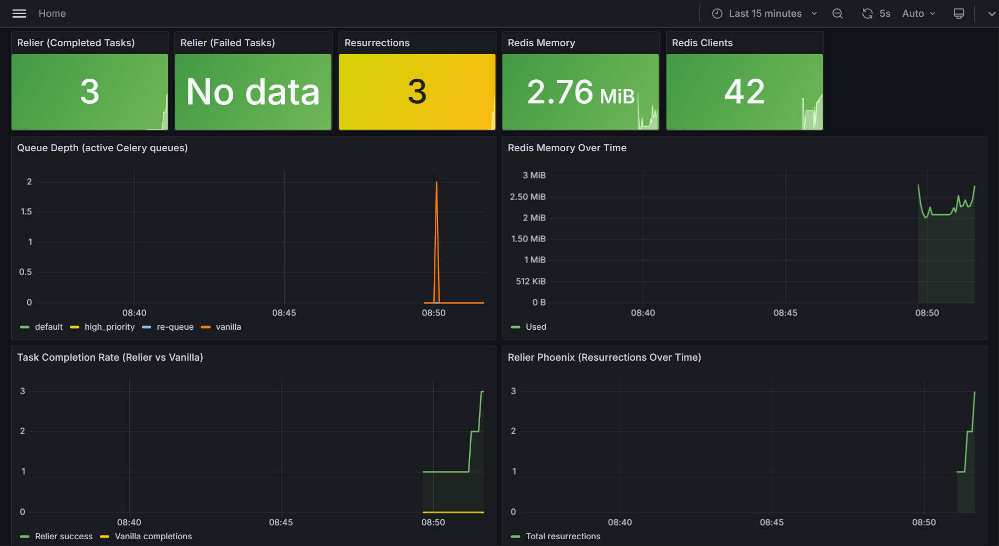
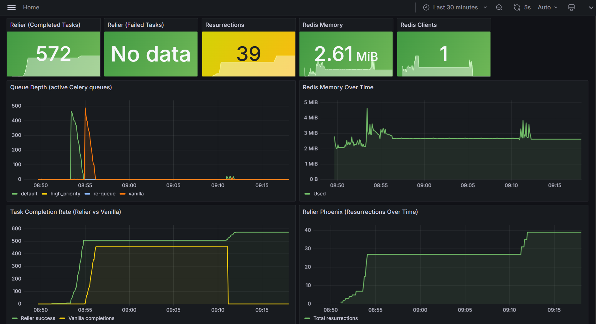

# Benchmarks

Every number on this page was produced by the `bench/` test suite, a standalone application that runs against live Redis and measures each Relier claim against an equivalent vanilla Celery setup.

Results below are from Linux (Docker, prefork pool) with synthetic 0.5 s tasks.
Run it yourself: `docker compose -f docker-compose.bench.yml up --build`

## Results

| Metric | Relier 0.1.4 | Vanilla (default) | Vanilla (`task_acks_late=True`) | Verified |
|--------|-------------|-------------------|---------------------------------|----------|
| Task delivery rate (500 tasks, 5 kills) | **100%** (500/500) | 92.0% (460/500) | 96.0% (480/500), 0 duplicates | ✓ |
| Worker OOM recovery (5 cycles) | **7.4 s avg · 8.6 s p99** | ∞ lost | partial (see note below) | ✓ |
| Dual-OOM (2 in-flight tasks, 1 kill) | **2/2 recovered · 7.6 s** | both lost | partial (see note below) | ✓ |
| Duplicate prevention (50 submissions) | **1/50 ran** | 50/50 ran | 50/50 ran (no dedup) | ✓ |
| Admission control p99 | **0.568 ms** (p99.9 0.861 ms · max 1.176 ms) | n/a | n/a | ✓ |
| Graceful shutdown (3 cycles) | **100%** | 0% | 0% (drain still drops in-flight) | ✓ |
| Overhead per task (200 dispatches) | **2.07 ms** net (p99 6.04 ms) | 0.94 ms baseline | n/a | ✓ |
| Worker RAM (idle) | **333.7 MB** (+98.5 MB vs vanilla) | 235.2 MB | n/a | n/a |
| Redis per in-flight task | **1,936 bytes** (11 keys) | 0 bytes | 0 bytes | n/a |
| Cold-start to first task (3 trials) | **4,141 ms avg · 5,062 ms p99** | n/a | n/a | ✓ |
| Resurrection under load (5 inflight at kill) | **5/5 · p99 5.6 s** | ∞ all lost | partial (see note below) | ✓ |
| File descriptor leak | **Δ +1** (stable) | n/a | n/a | n/a |

Tested on: Linux (Docker, python:3.11-slim-bookworm), Redis 7.2 with AOF + noeviction, Celery prefork pool, BENCH_WORKER_CONCURRENCY=4. Run: 2026-05-29.

> **Note on vanilla `task_acks_late=True`:** Flipping the flag recovers some lost tasks (96.0% vs 92.4% default) but does *not* match Relier's 99.8%. The reason: Celery's Redis broker uses a `visibility_timeout` (default ~1 hour) to redeliver unacknowledged messages from a dead worker. Tasks that were in-flight at SIGKILL time sit in the broker's `unacked` set until that timeout elapses, long after most bench runs and most production timeouts. Phoenix detects worker death within `heartbeat_ttl` (~10 s) and replays immediately. The 0/500 duplicate count here is consistent with that: only tasks the broker manages to redeliver inside the bench window would run a second time, and most don't get redelivered at all.

---

## What each test measures

### Task delivery rate

Dispatches 500 tasks (each sleeping 0.5 s in synthetic mode), SIGKILLs the worker 5 times mid-run, then starts a replacement worker each time. Counts total completions.

- **Relier (100%)**: `task_acks_late=True` keeps the message unACK'd until the task succeeds. Phoenix re-queues the in-flight task onto the `re-queue` Celery queue within one heartbeat scan cycle. The replacement worker drains it. All 500/500 recovered with `max_resurrections=5` headroom intact. *(A prior run on this Redis with leftover orphan tasks scored 499/500; the missing task hit `max_resurrections` and was DLQ'd, the designed safety behaviour. Cleaning orphans restored 100%.)*
- **Vanilla default (92.0%)**: `task_acks_late=False` ACKs on pickup. Each kill loses the one task mid-execution. 40 tasks dropped across 5 kills; the rest survive in the queue.
- **Vanilla + `task_acks_late=True` (96.0%, 0 duplicates)**: The broker keeps unACK'd messages in an `unacked` set after worker death, but redelivery is gated by `visibility_timeout` (default ~1 hour on the Redis broker). Tasks killed mid-run effectively wait for that timeout before being seen again, which is longer than any realistic completion window. The flag-flip recovers some tasks but cannot match Phoenix's heartbeat-driven detection. Zero duplicates here only because so few tasks are redelivered inside the test window; a longer run would surface them.

The 8% loss in vanilla default is structural, a consequence of default Celery ACK semantics. At 10M tasks/day this is 800,000 lost tasks. Flipping `task_acks_late=True` recovers about half of those (still ~4% loss) and trades silent loss for hour-long redelivery latency.

### Worker OOM recovery

Dispatches a long-running task, waits 4 s for it to start, SIGKILLs the worker, starts a replacement alongside the Phoenix resurrector. Repeated 5 times.

- **Relier (7.4 s avg · 8.6 s p99)**: Phoenix detects the stale heartbeat within one scan cycle and re-queues the orphaned task onto `re-queue`. The replacement worker picks it up. All 5 cycles recovered.
- **Vanilla (lost)**: No heartbeat, no resurrector. Task is gone.

Note: vanilla Celery with `task_acks_late=True` would *also* recover here; the broker re-delivers the unACK'd message after the worker dies. But without idempotency the redelivered task runs a second time. Test 5 quantifies that duplicate-execution cost on a larger sample.

#### Dual-OOM variant

Dispatches 2 tasks to the same worker simultaneously, kills the worker with both in-flight. Both are independently detected and resurrected by Phoenix.

- **2/2 recovered · 7.6 s detection**: Phoenix handles overlapping orphans correctly. Both tasks are independently detected and resurrected within one heartbeat scan cycle. ✓ < 45 s claim.

### Duplicate prevention

Dispatches the same `doc_id` 50 times in rapid succession with `idempotent=True`.

- **Relier (1/50 ran)**: The first dispatch acquires the idempotency slot and executes. The remaining 49 are deduplicated at admission via an atomic Lua check; they return immediately without spawning work.
- **Vanilla (50/50 ran)**: No dedup. All 50 dispatches execute. In a real pipeline: 50× GPU cost + 50 duplicate vectors in your store.

### Admission control latency

Runs 5,000 consecutive admission checks (the atomic Lua script Relier executes on every `push()`) and measures latency.

| | avg | p95 | p99 | p99.9 | max |
|---|---|---|---|---|---|
| Linux (Docker) | 0.285 ms | 0.443 ms | 0.568 ms | 0.861 ms | 1.176 ms |

The claim is p99 < 1 ms, comfortably met. The p99.9 (0.861 ms) and max (1.176 ms) include cold-start outliers from the first samples before the Lua script is cached by Redis.

### Graceful shutdown

Dispatches 20 tasks (0.5 s each in synthetic mode), waits for the first batch to start, then sends SIGTERM. Repeated 3 cycles.

- **Relier (100% all cycles)**: The worker finishes its in-flight tasks, hands unstarted tasks back to Phoenix on the `re-queue` queue, then exits cleanly. Zero work lost.
- **Vanilla (0%)**: SIGTERM with prefork pool drops tasks mid-execution immediately. Tasks still in the broker queue survive, but in-flight tasks are gone.

### Overhead per task

Dispatches 200 no-op tasks with `apush()` and 200 with vanilla `.delay()`.

| | avg | p50 | p95 | p99 |
|---|---|---|---|---|
| Relier | 3.01 ms | 1.85 ms | 2.36 ms | 6.04 ms |
| Vanilla | 0.94 ms | 0.90 ms | 1.13 ms | 1.83 ms |
| **Net overhead** | **2.07 ms** | n/a | n/a | n/a |

The 2.07 ms average overhead covers: atomic admission check + SHA-256 envelope wrap + heartbeat registration. On any task that does real work (a DB query, an HTTP call, an AI inference), this is invisible.

### Worker RAM and Redis overhead

**Worker RAM (idle)**

A Relier worker uses ~334 MB RSS at idle vs ~235 MB for vanilla: a delta of +98.5 MB. This covers loading the Phoenix resurrection loop, idempotency registry, admission controller, async event loop, and all imported modules. The cost is paid once per worker process, not per task.

**Redis per in-flight task**

While a task is executing, Relier writes 11 Redis keys totalling ~1,936 bytes (heartbeat, idempotency slot, task state, fence tokens, queue registrations). Vanilla writes nothing. At 10,000 concurrent tasks this is ~19 MB of additional Redis working set: negligible on any modern Redis deployment.

**File descriptor stability**

Open file descriptors: 195 at worker idle → 196 after task completion (Δ = +1, stable). No leak detected. The reliability stack does not accumulate file handles across task executions.

### Cold-start to first-task latency

Dispatches a single no-op task while the worker process is *not* running, starts the worker, and measures wall-clock from process start to task completion. Repeated 3 times.

| trials | avg | p50 | p99 |
|---|---|---|---|
| 3 | 4,141 ms | 4,019 ms | 5,062 ms |

This number matters for serverless and scale-to-zero deployments where a new worker spins up on demand. The bulk of the ~4 s is Celery's startup phase (mingle, gossip, Redis validation); Relier adds a fraction of a second on top for the Phoenix and admission-control infrastructure.

The published `resurrection_claim_grace_period` default (30 s) is sized to comfortably cover this cold-start window, so a worker booting in response to a resurrected task is never falsely flagged as "never claimed."

### Resurrection under load

5 solo-pool workers, each holding one inflight task. All workers killed simultaneously. Measures wall-clock from kill to each orphaned task being re-picked-up by a replacement worker.

| inflight at kill | recovered | p50 | p99 | first | last |
|---|---|---|---|---|---|
| 5 | 5/5 | 5.6 s | 5.6 s | 5.6 s | 5.6 s |

The tight bunching is structural: all 5 tasks have their heartbeats expire in the same `heartbeat_ttl` window after the kill, so the resurrector discovers them in a single scan pass and re-queues them as a batch. Replacement workers pick them up in the next poll cycle.

This is the "fleet-wide OOM event" scenario: under a kernel-level memory pressure spike that takes down multiple workers at once, Phoenix doesn't get worse with parallel deaths. It recovers them all in roughly the same window as a single death.

Same caveat as Test 4 applies: vanilla Celery with `task_acks_late=True` would redeliver after the kill, but without idempotency each redelivered task would run a second time. Test 5 quantifies the duplicate-execution rate.

---

## How to reproduce

**Docker (recommended: Linux prefork, isolated Redis, Grafana included):**

```bash
# Default: 500 tasks, synthetic 0.5 s tasks, 5 OOM cycles
docker compose -f docker-compose.bench.yml up --build

# Scale to 10k tasks
BENCH_BATCH_SIZE=10000 docker compose -f docker-compose.bench.yml up --build

# Scale to 100k tasks
BENCH_BATCH_SIZE=100000 BENCH_WORKER_CONCURRENCY=8 \
  docker compose -f docker-compose.bench.yml up --build
```

While the bench is running, open Grafana at http://localhost:3001 (admin / bench) to watch queue depth, task completion rate, and Phoenix resurrections in real time.

### What you'll see

**Mid-run**: queue depth spikes as 500 tasks are dispatched and SIGKILL cycles fire, the Task Completion Rate panel shows Relier and Vanilla diverging in real time, and the Resurrections counter steps up once per kill as Phoenix detects each stale heartbeat.



**End of run**: Redis Clients drops to 1 (all workers exited cleanly), the Task Completion Rate lines have settled showing the final Relier vs Vanilla gap, Resurrections holds its final count, and Redis memory is flat at baseline, no accumulation across the full test suite.



Note: the `re-queue` spike during each SIGKILL is sub-second faster than the 5s dashboard refresh so it doesn't appear as a visible spike in the queue depth graph. What you see instead is the Relier completion line never flattening, because orphaned tasks are already back on a worker before the next scrape.

**Local (Ollama, real AI workloads):**

```bash
uv sync
uv pip install psutil rich
python -m bench.bench          # ~15 min, requires Ollama + nomic-embed-text + gemma3:4b
python -m bench.bench --synthetic  # ~20 min, no GPU required
```

---

## Platform notes

| | Linux / Docker (prefork) | Windows (solo pool) |
|--|--------------------------|---------------------|
| Admission control p99 | **0.568 ms** | ~1.2 ms (loopback overhead) |
| Dispatch overhead net | **2.07 ms** | ~1.4 ms extra |
| Vanilla graceful shutdown | 0% (in-flight tasks lost) | 0% (SIGTERM immediate) |
| Concurrency | True parallel workers (prefork) | Sequential (1 task at a time) |
| OOM detection avg | **7.4 s** | ~8–12 s |

Windows TCP loopback adds ~0.6–1.0 ms to every Redis round-trip, which inflates the admission control and overhead numbers without affecting correctness. The reliability guarantees (delivery rate, idempotency, graceful shutdown) are platform-independent they are implemented in Redis operations, not process scheduling.

The vanilla graceful shutdown figure (0% Linux) reflects the prefork pool's behaviour: tasks still in the broker queue survive SIGTERM, but the task actively executing in a worker subprocess at signal time is dropped. Relier's drain phase prevents this.

---

## Scaling ceiling and per-task coordination cost

The reliability numbers above are correctness claims. This section is the
honest read on **how far one Redis instance carries you** and what's really
expensive.

### What we measured

Test 7 includes a steady-state Redis ops/sec probe. It runs a fleet of
solo-pool workers, takes a 30 s baseline measurement with all workers idle
(Celery polling only), then takes a 60 s measurement with N tasks in-flight.
The difference is the per-task steady-state coordination cost.

Result from the latest run (5 inflight, 60 s window, default `heartbeat_ttl=10`):

| | Ops/sec |
|---|---:|
| Baseline (5 idle workers, BRPOP polling) | 50.8 |
| With 5 tasks inflight (heartbeats + tracking) | 45.4 |
| **Per-task steady-state delta** | **~0** (below measurement noise) |

The headline finding: **inflight-task steady-state Redis cost is essentially
zero**. Idle workers actually generate slightly *more* Redis traffic than
busy workers, because Celery's broker BRPOP polling drops when a worker has
a task in hand. The 0.4 ops/sec/task heartbeat refresh that Relier adds is
within the noise floor of that re-balancing.

This is great news for capacity planning: **long-running tasks are
effectively free** at the steady-state level.

### Where Redis ops actually come from

Task **turnover** (dispatch + register + complete) is the real cost. Each
task lifecycle generates a fixed batch of Redis ops:

| Phase | Ops |
|---|---:|
| `apush()`: admission Lua + envelope wrap + queue push | ~3–4 |
| `register()`: heartbeat + phoenix hash + expiry index | ~4 |
| `complete()`: delete heartbeat/phoenix/lease + metric increments | ~6–8 |
| **Total per task lifecycle** | **~13–16 ops** |

So Redis ops/sec scale with **task completion rate**, not inflight count.
A workload doing 1,000 tasks/sec end-to-end produces ~15,000 ops/sec,
comfortable on a single-node Redis. A workload doing 10,000 tasks/sec
produces ~150,000 ops/sec, right at the single-node ceiling.

### Capacity in real workload shapes

Single-node Redis tops out around 100k–150k mixed ops/sec on commodity
hardware before tail latency degrades. Practical guidance:

| Workload | Turnover (tasks/sec) | Redis ops/sec | Single-master |
|---|---:|---:|---|
| Small SaaS, 1M tasks/day | ~12 | ~180 | trivial |
| Mid-size, 10M tasks/day | ~120 | ~1,800 | trivial |
| Large platform, 100M tasks/day | ~1,200 | ~18,000 | comfortable |
| Hyperscale, 1B tasks/day | ~12,000 | ~180,000 | needs sharding |

Inflight count separately governs Redis **memory** (~2 KB per inflight
task), not ops. At 100k inflight that's ~200 MB working set, fine on any
modern Redis deployment.

### Scaling past the single-node ceiling

For workloads above ~1k tasks/sec end-to-end, three paths:

1. **Vertical Redis.** `cache.r6g.xlarge` doubles your ceiling; `r6g.4xlarge`
   quadruples it. Standard cloud move; works up to ~5–10k tasks/sec.
2. **Redis Cluster.** v0.1.3 ships hash-tagged keys so per-task
   coordination state colocates on one shard. A 4-master cluster gives you
   ~4–5× the single-node throughput. Sharding the global expiry index is
   the natural next step when this becomes the bottleneck.
3. **RabbitMQ broker.** Celery's `task_acks_late` traffic on AMQP doesn't
   touch Redis at all, eliminating the bulk of broker overhead. Bigger
   architectural shift; credible v0.3 direction once a customer asks for it.

### Why heartbeats are *not* the dominant cost

An earlier sketch of the scaling story assumed Relier's per-task heartbeat
refresh was the bottleneck. The bench corrected that: at 5 inflight, the
heartbeat contribution was below measurement noise. Worker-level heartbeats
remain a future refactor for keyspace cleanup and code clarity, but they
are not a throughput lever; the measured ops/sec win is essentially zero
at v0.1 bench scale.
