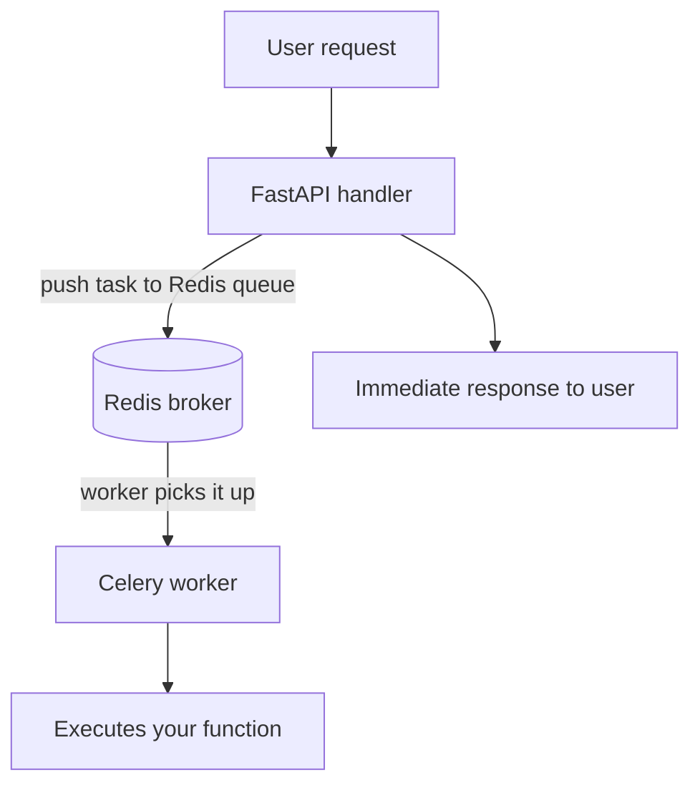
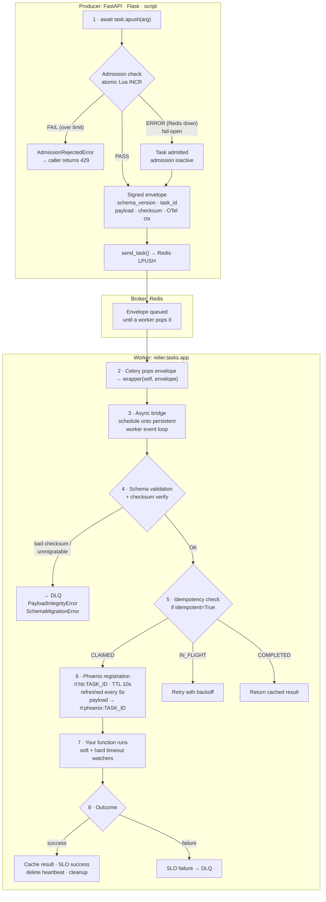

# Core Concepts

This page explains the key ideas behind Relier. You don't need to read it before getting started; the [Quickstart](quickstart.md) covers that. But understanding these concepts will help you make better decisions about how to use Relier in production.

---

## What Relier is and is not

Getting this right up front saves a lot of confusion.

**Relier is a thin wrapper around Celery, not a replacement for it.** Your workers are still plain Celery workers. Your Redis is still the broker. Your tasks still look like Celery tasks. Relier adds a lifecycle layer: heartbeat tracking, crash detection, resurrection, idempotency enforcement, timeouts, graceful shutdown, without changing your function bodies or your infrastructure.

### Not a workflow engine

[Temporal](https://temporal.io) and [Hatchet](https://hatchet.run) are *workflow engines*. They model multi-step processes with deterministic replay, durable execution across restarts, and saga-style compensation. That is a different problem and a different programming model: you restructure your code around their execution model and deploy their server.

Relier is not that. It handles individual task reliability, not workflow orchestration. The choice isn't "Relier vs. Temporal", it's "naked Celery vs. Relier + Celery." If you need multi-step workflows spanning hours or approval gates, reach for Temporal or Hatchet. If you have Celery tasks and want them to stop disappearing, that's Relier.

### Not a DAG runner

[Prefect](https://prefect.io), [Airflow](https://airflow.apache.org), [Dagster](https://dagster.io) schedule and orchestrate pipelines of *dependent* tasks. They have schedulers, UIs, backfill, and pipeline-level retry. Relier has none of that. It makes individual tasks reliable; what those tasks do and when they run is still Celery's responsibility.

### Not a Celery replacement

You don't swap Celery for Relier. You keep Celery and add Relier on top. The decorator, the queues, the `celery worker` command, the broker nothing changes. If you later outgrow Relier's model, you can remove the decorator and go back to vanilla Celery with zero migration cost.

---

## Async-first by design, sync-compatible by necessity

Relier's orchestration layer is built on asyncio. Every worker process owns a
**single persistent event loop** created once at startup and reused for every
task there is no per-task loop construction, no per-task Redis pool, no
`asyncio.run()` on the hot path. Tasks dispatched from FastAPI continue the
same trace context that started the HTTP request, and admission/dispatch
operations are themselves `async def` so a busy producer never blocks the
event loop.

That said, much of the Python ecosystem is sync: Flask, classic Django, CLI
tools, management commands, scheduled scripts. Relier supports them too, with
no compromise on reliability:

| You are here… | Use this | What happens |
|---|---|---|
| FastAPI / Starlette / async Django | `await task.apush(...)` | Runs on the calling task's event loop. No extra bridging. |
| Flask / classic Django / scripts / sync task body | `task.push(...)` | Sync wrapper. Inside a worker (sync task body), schedules the dispatch onto the worker loop via `run_coroutine_threadsafe`; otherwise falls back to `asyncio.run()`. Raises `RuntimeError` if called from a thread that already has a running loop (use `apush` there). |

Both paths run the **same** reliability stack, admission control, schema
envelope, OTel context injection. The only difference is whether the caller
needs to `await`. Detailed explanation in
[Architecture → The Async/Celery Bridge](architecture.md#the-asynccelery-bridge).

> **Note:** Don't call `task.delay()` or `task.apply_async()` directly. Those
> are Celery's native dispatch methods and they bypass Relier's admission
> control and signed envelope. They're available because `@rl_task` is built
> on Celery's `shared_task`, but in application code, always use `apush` or
> `push`. The only intentional caller of `.delay()` is `rl bench`, which uses
> it as a measurement baseline.

---

## What dispatch returns, and how to use it in a route

Both `apush` and `push` return a Celery
[`AsyncResult`](https://docs.celeryq.dev/en/stable/reference/celery.result.html).
Relier is a thin layer over Celery, so it hands you Celery's own task handle
rather than inventing a new type you'd have to learn. Because Relier configures
**Redis as the result backend**, that handle is live:

| You call | You get | What it's for |
|---|---|---|
| `receipt.id` | task UUID (`str`) | correlation, logging, status lookup. **This is what you return to clients 95% of the time.** |
| `receipt.status` | `"PENDING"` → `"STARTED"` → `"SUCCESS"`/`"FAILURE"` | polling progress |
| `receipt.ready()` | `bool` | non-blocking "is it done?" |
| `receipt.get()` | the task's return value | **blocks** until the task finishes — see the warning below |

`apush`/`push` are **fire-and-forget**: they return the instant the task is
*enqueued*, not when it *runs*. The whole point of a task queue is that the HTTP
request returns immediately while the work happens in the background.

> **Typed handle.** The methods are annotated as `TaskReceipt` (a `Protocol`),
> so `receipt.id` autocompletes as `str` and typos are caught — even though
> Celery itself ships no types. At runtime it's still a Celery `AsyncResult`.
> Import `from relier import TaskReceipt` to annotate your own code. Details in
> [API Reference → `TaskReceipt`](api-reference.md#taskreceipt).

!!! danger "Don't block your route on `receipt.get()`"
    `AsyncResult.get()` is synchronous and blocks the calling thread until the
    worker finishes — in an async route that stalls the entire event loop. The
    idiomatic pattern is **return the task ID, poll separately**. Only block
    in-request (via `await asyncio.to_thread(receipt.get)`) for short tasks
    where the caller truly needs the result inline.

### Copy-paste: FastAPI (dispatch + status polling)

A complete, runnable two-file app. Dispatch returns the task ID immediately; a
second endpoint reports status without ever blocking the loop.

```python
# tasks.py
from relier import rl_task

@rl_task(queue="default", idempotent=True, soft_timeout=25, hard_timeout=30)
async def send_invoice(invoice_id: str) -> dict:
    # Replace with your real work (Stripe call, DB write, email, …).
    await charge_card(invoice_id)
    return {"charged": True, "invoice_id": invoice_id}
```

```python
# main.py
from fastapi import FastAPI, Request
from fastapi.responses import JSONResponse
from celery.result import AsyncResult

from relier.core.exceptions import AdmissionRejectedError
from relier.tasks.app import celery_app
from tasks import send_invoice

app = FastAPI()

@app.exception_handler(AdmissionRejectedError)
async def at_capacity(_: Request, exc: AdmissionRejectedError) -> JSONResponse:
    return JSONResponse(
        status_code=429,
        headers={"Retry-After": str(exc.retry_after)},
        content={"detail": "Service at capacity, retry later."},
    )

@app.post("/invoices/{invoice_id}/send")
async def dispatch_invoice(invoice_id: str) -> dict:
    receipt = await send_invoice.apush(invoice_id)   # async → apush
    return {"task_id": receipt.id, "status": "queued"}   # return immediately

@app.get("/tasks/{task_id}")
async def task_status(task_id: str) -> dict:
    r = AsyncResult(task_id, app=celery_app)
    return {
        "task_id": task_id,
        "status": r.status,                      # PENDING / STARTED / SUCCESS / FAILURE
        "result": r.result if r.ready() else None,
    }
```

Run it (three terminals):

```bash
uvicorn main:app --reload                                                   # web app
celery -A relier.tasks.app worker -l info -Q high_priority,default,low_priority,re-queue --include=tasks
rl run-resurrector                                                          # crash recovery
```

Try it:

```bash
curl -X POST localhost:8000/invoices/INV-001/send
# {"task_id":"f8a2…","status":"queued"}
curl localhost:8000/tasks/f8a2…
# {"task_id":"f8a2…","status":"SUCCESS","result":{"charged":true,"invoice_id":"INV-001"}}
```

### Copy-paste: Flask (sync → `push`)

```python
# app.py
from flask import Flask, jsonify
from relier.core.exceptions import AdmissionRejectedError
from tasks import send_invoice          # same tasks.py as above

app = Flask(__name__)

@app.errorhandler(AdmissionRejectedError)
def at_capacity(exc: AdmissionRejectedError):
    resp = jsonify(detail="Service at capacity, retry later.")
    resp.status_code = 429
    resp.headers["Retry-After"] = str(exc.retry_after)
    return resp

@app.post("/invoices/<invoice_id>/send")
def dispatch_invoice(invoice_id: str):
    receipt = send_invoice.push(invoice_id)   # sync → push, no await
    return jsonify(task_id=receipt.id, status="queued"), 202
```

### Copy-paste: Django (sync view → `push`)

```python
# views.py
from django.http import JsonResponse
from django.views.decorators.http import require_POST
from relier.core.exceptions import AdmissionRejectedError
from .tasks import send_invoice

@require_POST
def dispatch_invoice(request, invoice_id: str):
    try:
        receipt = send_invoice.push(invoice_id)   # sync view → push
    except AdmissionRejectedError as exc:
        resp = JsonResponse({"detail": "at capacity"}, status=429)
        resp["Retry-After"] = str(exc.retry_after)
        return resp
    return JsonResponse({"task_id": receipt.id, "status": "queued"}, status=202)
```

> **The one rule to remember:** async caller → `await task.apush(...)`; sync
> caller → `task.push(...)`. Calling `push` from async code raises a
> `RuntimeError` (it would otherwise deadlock the event loop). More framework
> recipes — async Django, management commands, scripts — are in
> [Integrations](integrations.md). Starlette works exactly like FastAPI (FastAPI
> is built on it): use `await task.apush(...)`.

---

## What is Celery? (Quick primer)

If you already know Celery, skip ahead. For a more thorough walkthrough see the
dedicated [Celery Primer](celery-primer.md).

**Celery** is a task queue library for Python. Instead of doing slow work (sending emails, calling APIs, processing files) inside your web request, you put that work on a queue. Background worker processes pick tasks off the queue and execute them independently of your web server.



This is a great pattern. But vanilla Celery has no protection against workers dying mid-task, no safe retry strategy, no visibility into what's running, and no graceful shutdown. That's what Relier adds.

---

## Mental model: what happens when you dispatch a task

End-to-end, from `await task.apush(...)` returning to the cache being filled.
Knowing this flow makes every other piece of the docs click into place.



Every reliability guarantee Relier offers maps onto one of these steps. The
rest of this page explains the *why* behind each mechanism.

!!! warning "Workers must use Relier's Celery app"
    Steps 2–8 above only happen when your workers are started with **Relier's Celery app** (`relier.tasks.app`):

    ```bash
    celery -A relier.tasks.app worker ...
    ```

    If you create your own `Celery()` instance and start workers with `-A your_app`, the worker will run the task but bypass the entire lifecycle: no heartbeating, no Phoenix registration, no idempotency enforcement, no graceful shutdown. The `@rl_task` decorator will still run, but only the dispatch-side features (admission control, signed envelope) work outside the managed worker. When in doubt, use `rl worker start` which wires everything correctly.

---

## The Phoenix Pattern (Zero-Job-Loss)

This is Relier's core guarantee: **no task is silently lost when a worker dies**.

### The problem

Imagine a worker is halfway through processing a payment when it's OOM-killed by the OS. In most default Celery setups, a worker crash during execution leaves the task orphaned: it disappears from the queue without completing, with no error and no trace. The payment never completes.

### How Phoenix works

Every task Relier runs writes a **heartbeat** to Redis, a key with a short TTL (default 10 seconds). As long as the task is running, a background loop keeps refreshing that TTL. The task is also registered in a **Phoenix registry** (a Redis hash) with its full payload.

```
Task starts
  → heartbeat key created (rl:hb:{task_id}) with 10s TTL
  → payload stored (rl:phoenix:{task_id})
  → background loop refreshes heartbeat every 5s

Task completes
  → heartbeat deleted
  → Phoenix registry cleared
```

Meanwhile, a **resurrector** process runs continuously, scanning for heartbeats that have expired without the payload being cleared. An expired heartbeat + existing payload = dead worker.

```
Resurrector scans every 2 seconds
  → finds rl:hb:{task_id} expired but rl:phoenix:{task_id} still exists
  → acquires a distributed lock (prevents duplicate resurrection)
  → re-queues the task to a fresh worker
  → logs the resurrection in rl:monitoring
```

**The result:** the task is back in queue on a healthy worker, typically within **~12 seconds** of a crash (heartbeat TTL of 10s + the 2s scan interval), and within **35 seconds** as a conservative worst-case ceiling. The task's original arguments are preserved exactly as they were at enqueue time.

### The resurrection limit

A task that consistently crashes workers is dangerous. After `max_resurrections` attempts (default: 5), Relier quarantines the task in the [Dead Letter Queue](#dead-letter-queue) instead of re-queuing it, so it can't keep taking down workers.

### The resurrector process

The resurrector is a separate process you run alongside your workers. It's usually a single dedicated container:

```bash
rl run-resurrector
# or in Docker Compose: a 'guardian' service
```

It needs read/write access to Redis but doesn't process any task payloads it only moves them between queues.

---

## Idempotency (Safe Retries)

**Idempotency** means: calling a function multiple times with the same input produces the same result as calling it once. For tasks, it means: a task that runs twice doesn't cause side effects twice.

### The problem

When a worker dies mid-task, the task gets re-queued by Phoenix and run again. Without idempotency, that's a problem:

```
Task: charge customer $100
  → Runs on worker A
  → Stripe charge succeeds
  → Worker A dies before Celery can ACK the task
  → Phoenix re-queues the task
  → Runs on worker B
  → Stripe charge runs again → customer charged $200
```

### How Relier's idempotency works

When you set `idempotent=True`, Relier runs an **atomic Redis Lua script** before executing your function. The script checks whether this exact task (identified by a hash of its arguments) has already been run.

There are three possible outcomes:

| State | Meaning | Action |
|-------|---------|--------|
| `CLAIMED` | First time seeing this task | Run the function, cache the result |
| `IN_FLIGHT` | Another worker is currently running this exact task | Retry with 5-second backoff |
| `COMPLETED` | This task already ran successfully | Return the cached result immediately |

"Atomic" here is important. The check-and-set happens in a **single Redis operation** using a Lua script, so there's no race condition between two workers trying to claim the same task simultaneously. One wins, one sees `IN_FLIGHT`.

```python
@rl_task(
    idempotent=True,
    idempotency_ttl=3600,   # cache the result for 1 hour
)
async def charge_customer(customer_id: str, amount_cents: int) -> dict:
    result = await stripe.charge(customer_id, amount_cents)
    return {"charge_id": result.id}

# First call with customer_id="cus_abc" → runs, charges card, caches result
# Second call with customer_id="cus_abc" (any time within 1 hour) → returns cached result, no charge
```

### Manual idempotency for complex cases

Sometimes you need more control over the idempotency key:

!!! warning "Async only"
    `idempotency_lock` is an async context manager (`async with`). It only works inside `async def` task functions. Do not use it in synchronous tasks.

```python
from relier.core.idempotency import idempotency_lock

@rl_task()
async def process_webhook(event_id: str, payload: dict) -> dict:
    # Use the event_id as the key instead of hashing all args
    async with idempotency_lock(key=event_id, ttl=86400) as lock:
        if lock.already_executed:
            return lock.cached_result
        result = await handle_webhook(payload)
        lock.set_result(result)    # sync: committed automatically on exit
        return result
```

---

## Task Timeouts (Soft + Hard)

Zombie tasks, basically tasks that run forever and never finish hold workers hostage and starve other tasks in the queue. Relier gives you two levels of timeout control.

### Soft timeout

The soft timeout is a **warning**. When it fires, your cleanup hook gets called. You can save partial work, release locks, log state, whatever you need. The task is not cancelled yet.

### Hard timeout

The hard timeout is **unconditional**. When it fires, the task coroutine is cancelled immediately, regardless of what it's doing.

!!! warning "Always set `hard_timeout`: omitting it does not mean no timeout"
    When `hard_timeout` is not set, Relier's internal async bridge applies a **300-second fallback** deadline. After 300 s the bridge raises `TimeoutError` and Celery marks the task failed, but the coroutine may still be running in the background until its next `await` checkpoint. Always set `hard_timeout` to match your task's expected worst-case duration. See [API reference → `hard_timeout`](api-reference.md#hard_timeout) and [Troubleshooting → Async bridge timeout](troubleshooting.md) for details.

```python
from relier.tasks.context import TaskContext

async def save_progress(ctx: TaskContext) -> None:
    """Called at soft timeout. You have (hard - soft) seconds to clean up."""
    # The task body recorded progress into ctx.metadata as it ran;
    # the hook reads it from there and persists it as a checkpoint.
    progress = ctx.metadata.get("progress")
    if progress is not None:
        await ctx.set_partial(progress)
    await release_your_lock(ctx.args[0])   # your own cleanup, not a Relier API

@rl_task(
    soft_timeout=25,
    hard_timeout=30,
    on_soft_timeout=save_progress,
)
async def process_large_file(file_id: str, ctx: TaskContext = None) -> dict:
    # On resurrection, ctx.partial_result has the last saved progress.
    resume_at = (ctx.partial_result or {}).get("bytes_read", 0)
    async for chunk in stream_file(file_id, offset=resume_at):
        await crunch(chunk)
        # Track progress in memory; save_progress reads this at soft timeout.
        ctx.metadata["progress"] = {"bytes_read": chunk.end_offset}
    return {"status": "done"}
```

The soft/hard gap (`hard - soft`, in this case 5 seconds) is the window your cleanup hook has to finish. Design it to complete well within that window.

!!! info "`ctx.metadata` vs `ctx.partial_result`: two different things"
    **`ctx.metadata`** is a plain in-memory `dict` that lives only for the duration of the current execution. It is never written to Redis. Use it to pass transient runtime state between the task body and the soft-timeout hook, e.g. recording a loop cursor so the hook knows what to checkpoint.

    **`ctx.partial_result`** is the value previously written by `await ctx.set_partial(...)`. It is persisted to Redis (and carried with the task through resurrection), and injected back into the task on the next run. Use it to resume from where the last incarnation left off.

    Typical flow: the task body writes progress into `ctx.metadata` → at soft timeout, the hook reads `ctx.metadata` and calls `await ctx.set_partial(...)` → next incarnation starts with `ctx.partial_result` set.

    Note: `ctx.set_partial` is `async def` and must be `await`ed.

!!! info "The hook doesn't magically know what to save"
    Relier can't introspect your task to figure out where the loop got to. The task body must record its progress somewhere the hook can read, `ctx.metadata` is the standard place, or the task can call `ctx.set_partial(...)` directly as it runs. Three concrete patterns (inline, hook-only, hybrid) are in [Patterns → Pattern 3](patterns.md#pattern-3).


??? question "Why aren't checkpoints automatic? (Design rationale)"
    A reasonable question: why doesn't Relier just figure out where the task
    stopped on its own? The short answer is that every approach to "automatic
    checkpoints" trades real reliability for the appearance of convenience.

    - **Frame introspection** (capturing local variables at soft timeout) would
      auto-serialise whatever happens to be in scope. That includes request
      bodies, secrets, JWTs, and PII which then land in Redis, replicate to
      every node, and end up in your AOF and your S3 backups. It's an
      accidental data-exfiltration channel.
    - **Coroutine pickling** (the Temporal model) requires a different
      programming model from regular Python, no open sockets, no file
      handles, every step a serialisable boundary. It's a much larger system,
      not a checkpoint feature.
    - **Bytecode rewriting of loops** breaks the moment a task has more than
      one loop, conditional iteration, or recursion. It also makes the runtime
      behaviour invisible to anyone reading the code.

    The deeper reason: Relier can't know what's "important state" vs
    "transient computation" without you telling it. The task body has that
    information; the framework doesn't. Every production task-queue system
    converges on the same answer, explicit checkpoints. The reason isn't
    laziness on the framework's part; it's that implicit state is the worst
    kind of state when something breaks at 3 AM.

    What Relier *does* do for you:

    - Routes the checkpoint through size-aware storage (inline → filesystem
      blob → reject) so a careless save can't bring down Redis.
    - Garbage-collects the checkpoint when the task completes or quarantines.
    - Re-injects the checkpoint as `ctx.partial_result` on the next
      incarnation, no manual key lookup needed.
    - Carries the checkpoint with the task across the DLQ boundary (release
      from DLQ restores the checkpoint too).

    The explicit `ctx.set_partial(data)` + `ctx.metadata[...] = ...` pattern is
    deliberate. A future helper for the "iterate a paginated source and save
    every N items" case may land if real workloads converge on the same
    shape, but the explicit API stays as the primitive.

---

## Checkpoints and partial-result storage

A long-running task that gets killed and resurrected would normally restart
from scratch, redoing all the work the previous incarnation completed. Relier
lets the soft-timeout hook (or the task itself) save a **checkpoint**, a JSON
blob describing how far the task got and the next incarnation receives it as
`ctx.partial_result`.

```python
async def save_checkpoint(ctx: TaskContext) -> None:
    await ctx.set_partial({"items_processed": 750, "last_cursor": "item_750"})

@rl_task(soft_timeout=55, hard_timeout=60, on_soft_timeout=save_checkpoint)
async def process_items(cursor: str = "start", ctx: TaskContext = None) -> dict:
    start = ctx.partial_result.get("last_cursor", cursor) if ctx.partial_result else cursor
    async for item in fetch_items(start):
        await process(item)
    return {"total": 1000}
```

Checkpoints have a size budget because Redis is shared infrastructure. Relier raises `CheckpointTooLargeError` if a checkpoint exceeds the inline limit, rather than silently bloating Redis.

??? note "Checkpoint size tiers and filesystem spillover"
    | Checkpoint size | Default behaviour | Configurable via |
    |---|---|---|
    | ≤ 256 KB | Stored inline in the Phoenix Redis hash. | `RELIER_CHECKPOINT_MAX_INLINE_BYTES` |
    | > 256 KB, **no** filesystem backend | **`CheckpointTooLargeError` raised**: `set_partial` fails loudly. | default, must opt in to spillover |
    | > 256 KB, filesystem backend enabled | Gzipped, written to a shared volume. Only a tiny reference envelope stays in Redis. | `RELIER_CHECKPOINT_BACKEND=filesystem` + `RELIER_CHECKPOINT_DIR` |

    The "rejected by default" behaviour is deliberate: silent bloat is worse than a loud error. When you need bigger checkpoints, enable the filesystem backend and point it at storage that *every* worker and the resurrector can see. A checkpoint written by `worker-high` may later be read by `worker-recovery` when Phoenix resurrects the task on a different process. The bundled `docker-compose.prod.yml` handles this with a shared named volume.

See [API → `ctx.set_partial`](api-reference.md#ctx-set-partial) for the
full lifecycle.

---

## Graceful Shutdown

Every production system restarts workers eventually, deploys, autoscaling, Kubernetes node rotation. Vanilla Celery's `SIGTERM` handler drops all in-flight tasks immediately. Relier's doesn't.

### What happens when Relier receives `SIGTERM`

1. **Drain mode**: the worker stops accepting new tasks from the queue.
2. **Wait**: Relier waits up to `graceful_shutdown_timeout` seconds (default: 30) for running tasks to finish.
3. **Handoff**: tasks that won't finish in time have their heartbeats deleted. The resurrector picks them up on the next scan and re-queues them on a different worker.
4. **Clean exit**: zero tasks dropped.

```bash
$ rl worker drain rl-worker-2
Initiating drain sequence: rl-worker-2
Signal broadcasted.
Worker will now enter the drain phase and exit cleanly.
```

---

## Admission Control

When your queue is full or your workers are overloaded, accepting more tasks makes things worse, it just queues work that can't be processed, and the backlog grows. Admission control lets you reject incoming requests before they reach your workers.

Relier implements admission control with a **Redis Lua script** that runs atomically, no race conditions, no double-counting.

```lua
-- Simplified version of what runs in Redis
local count = redis.call('INCR', window_key)
if count == 1 then redis.call('EXPIRE', window_key, window_seconds) end
if count > limit then return "rejected" end
return "admitted"
```

When a request is rejected, `apush`/`push` raise `AdmissionRejectedError` with a
`retry_after` attribute. Your web layer should catch it and return HTTP 429 with
a `Retry-After` header. Here it is in all three frameworks:

=== "FastAPI"

    ```python
    from relier import rl_task, AdmissionRejectedError
    from fastapi import FastAPI, Request
    from fastapi.responses import JSONResponse

    app = FastAPI()

    # A single handler covers every route that dispatches a task.
    @app.exception_handler(AdmissionRejectedError)
    async def at_capacity(_: Request, exc: AdmissionRejectedError) -> JSONResponse:
        return JSONResponse(
            status_code=429,
            headers={"Retry-After": str(exc.retry_after)},
            content={"detail": "Service at capacity, retry later."},
        )

    @app.post("/tasks/process")
    async def submit_task(item_id: str) -> dict:
        await my_task.apush(item_id)        # async → apush
        return {"status": "queued"}
    ```

=== "Flask"

    ```python
    from relier import AdmissionRejectedError
    from flask import Flask, jsonify

    app = Flask(__name__)

    @app.errorhandler(AdmissionRejectedError)
    def at_capacity(exc: AdmissionRejectedError):
        resp = jsonify(detail="Service at capacity, retry later.")
        resp.status_code = 429
        resp.headers["Retry-After"] = str(exc.retry_after)
        return resp

    @app.post("/tasks/process")
    def submit_task():
        my_task.push(request.json["item_id"])   # sync → push
        return jsonify(status="queued"), 202
    ```

=== "Django"

    ```python
    # views.py
    from relier import AdmissionRejectedError
    from django.http import JsonResponse
    from django.views.decorators.http import require_POST

    @require_POST
    def submit_task(request, item_id: str):
        try:
            my_task.push(item_id)               # sync view → push
        except AdmissionRejectedError as exc:
            resp = JsonResponse({"detail": "at capacity"}, status=429)
            resp["Retry-After"] = str(exc.retry_after)
            return resp
        return JsonResponse({"status": "queued"}, status=202)
    ```

`AdmissionRejectedError` is importable straight from the top-level package
(`from relier import AdmissionRejectedError`).

If Redis is unavailable, admission control **fails open**, it admits the request rather than blocking your API. Availability is prioritised over rate limiting.

---

## Dead Letter Queue

The DLQ is where tasks go when they can't be recovered automatically. A task lands in the DLQ when:

- It has been resurrected `max_resurrections` times and still hasn't succeeded.
- Its payload checksum fails (someone tampered with it, or serialisation broke).
- It consistently triggers a hard timeout.

The DLQ stores the full payload, the error reason, the resurrection count, and any partial checkpoint the task saved. Nothing is thrown away.

```bash
$ rl dlq list

  ID              TASK               RESURRECTIONS  QUARANTINED_AT       LAST_ERROR
  ──────────────────────────────────────────────────────────────────────────────────
  task_f8a2b1     process_document   5/5            2026-05-15 02:14     JSONDecodeError
  task_c3d9e2     process_webhook    5/5            2026-05-15 01:58     MemoryError

$ rl dlq inspect task_f8a2b1   # full payload + error + resurrection history
$ rl dlq release task_f8a2b1   # fix the root cause, then release it
$ rl dlq retry-all             # re-release everything at once
```

A task in the DLQ does not affect other tasks at all. Workers are no longer exposed to it.

---

## Task Payload Schema Versioning

Rolling deploys are tricky. You push new code to half your workers while the other half still run the old code. If your new code changes a task's argument structure, tasks enqueued by old producers may fail when picked up by new workers.

Relier wraps every task payload in a **versioned envelope**:

```json
{
  "schema_version": 1,
  "task_id": "task_abc123",
  "payload": { "args": ["INV-001"], "kwargs": {} },
  "checksum": "sha256:a3f9...",
  "enqueued_at": "2026-05-15T02:00:00Z"
}
```

If you change a task's signature in a breaking way, register a **migration**. This requires two steps (both are required):

```python
from relier.core.schema import SchemaRegistry

# Step 1: bump CURRENT_VERSION so new payloads are tagged at version 2
#         and old version-1 payloads enter the migration loop.
SchemaRegistry.CURRENT_VERSION = 2

# Step 2: register the handler that upgrades v1 → v2 payloads.
@SchemaRegistry.register_migration("myapp.process_order", from_version=1)
def migrate_v1_to_v2(args, kwargs):
    # Old signature: process_order(order_id)
    # New signature: process_order(order_id, region="global")
    kwargs.setdefault("region", "global")
    return args, kwargs
```

!!! warning "Bump `CURRENT_VERSION` before registering the migration"
    The migration loop runs as `while payload_version < CURRENT_VERSION`. If you register a migration but don't bump `CURRENT_VERSION`, the loop never runs and old payloads reach your function with the old signature, causing a `TypeError`. Relier logs a warning at startup if this misconfiguration is detected.

Old payloads in the queue are automatically migrated when picked up. No failed tasks, no manual intervention, no deploy window restrictions. Full reference: [API → `SchemaRegistry`](api-reference.md#schemaregistry).

---

## SLO Burn Rate Monitoring

Relier tracks your task delivery rate against a target SLO (default: 99.9%). It calculates **burn rates** across multiple rolling windows using the same model as Google SRE:

| Burn Rate | Meaning |
|-----------|---------|
| `0×` | No failures at all |
| `< 1×` | On or under budget, healthy |
| `1×` | Consuming budget at exactly the target rate |
| `> 1×` | Consuming budget faster than allowed |
| `14.4×` | Budget exhausted in 2 hours, critical |

```bash
$ rl slo status

  Relier Reliability Dashboard
  SLO target: 99.9% (43.2 min/month budget)

  Window   Burn Rate   Status
  ──────────────────────────────
  1h       0.42×       HEALTHY
  6h       0.38×       HEALTHY
  3d       0.21×       HEALTHY

Budget used: 0.3 min (0.6% of monthly)
All reliability targets are being met.
```

---

## OpenTelemetry (Distributed Tracing)

Every significant event Relier produces emits an OTEL span. Set `RELIER_OTEL_ENABLED=true` and point `RELIER_OTEL_EXPORTER_OTLP_ENDPOINT` at your OTLP collector.

The span hierarchy mirrors the task lifecycle:

```
rl.request.admitted          ← admission control check
  rl.task.enqueue            ← task pushed to Redis queue
    rl.worker.pickup         ← worker dequeued the task
      rl.schema.migrate      ← (only if migrating from old schema version)
      rl.idempotency.check   ← (only if idempotent=True)
      rl.task.execute        ← your function runs here
        rl.heartbeat.emit    ← (periodic, every heartbeat_ttl/2 seconds)
        rl.timeout.soft      ← (only if soft timeout fires)
      rl.task.complete       ← (or rl.task.failed)
        rl.resurrection.queue  ← (only if worker died)
          rl.dlq.quarantine    ← (only if max_resurrections exceeded)
```

Each span carries standard attributes like `rl.task.id`, `rl.task.name`, `rl.task.queue`, `rl.task.is_resurrection`, `rl.task.resurrection_count`, and more.
