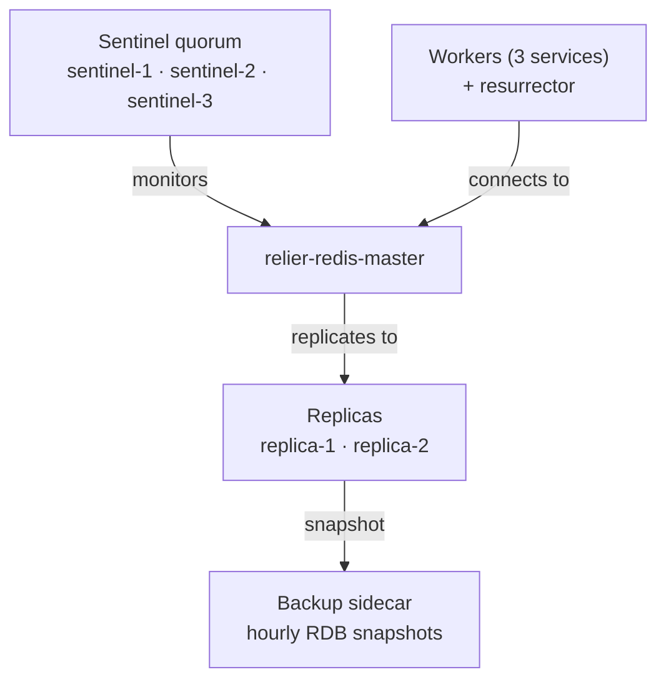

# Deployment

Relier is a plain Python library, the engine (`@rl_task`, the Phoenix
resurrector, idempotency, DLQ, admission control, SLO tracking) is pure Python.
Like Celery, it runs as ordinary processes. **Docker is a convenience, not a
requirement**: nothing in Relier depends on running inside a container.

There is exactly one hard dependency: **a reachable Redis with persistence
enabled**. Relier preflight-checks Redis at startup and refuses to start with a
clear error if it is unreachable or misconfigured nothing comes up half-working.

This guide covers the three supported ways to run Relier:

| Tier | Redis | How | Use for |
|------|-------|-----|---------|
| **Bare metal** | You provide one | `make worker` + `make resurrector` | Local development, CI, tests, integrating into an existing host |
| **Docker dev** | Single node, AOF + RDB | `make dev` (uses `docker-compose.yml`) | A full local cluster that mirrors prod shape |
| **Docker prod** | HA: master + replicas + Sentinel + backup | `make prod` (uses `docker-compose.prod.yml`) | Production deployments on a VM or single host |
| **Kubernetes** | StatefulSet or managed Redis | YAML manifests below | Multi-host production |

Relier always runs the same two process types regardless of tier: **Celery
workers** consuming task queues, and the **Phoenix resurrector** scanning for
dead workers. Only the surrounding infrastructure changes.

---

## Before you deploy: what Relier needs

Two things, every tier:

1. **Redis with persistence enabled and `maxmemory-policy noeviction`.** Without
   persistence, a Redis restart drops every heartbeat and payload in flight,
   the zero-job-loss guarantee breaks. Without `noeviction`, Redis can silently
   evict heartbeats under memory pressure, causing the resurrector to misread a
   live worker as dead and re-queue tasks (duplicate execution). Relier
   validates `maxmemory-policy` at worker startup and refuses to start if it is
   wrong. See [Production Redis configuration](#production-redis-configuration).

2. **A running resurrector process** (`rl run-resurrector`). This is the
   separate process that scans for dead workers and re-queues their orphaned
   tasks. If it is not running, tasks that die with a worker stay dead.

Everything else, admission control, SLO tracking, DLQ, idempotency is
already inside the worker process. You only need to run the worker and the
resurrector.

---

## Tier 1: Bare metal (no Docker)

The simplest way to run Relier. Useful for local development, CI, and any host
where Docker is overkill.

**Prerequisites:** Python 3.11+, and a reachable Redis (`brew install redis &&
redis-server`, a system package, a remote instance anything). Set
`RELIER_REDIS_URL` if it is not `redis://localhost:6379/0`.

### Using the bundled Makefile

```sh
make setup                       # create the venv and install Relier
export RELIER_REDIS_URL=redis://localhost:6379/0

make worker                      # terminal 1: a Celery worker
make resurrector                 # terminal 2: the Phoenix resurrector
```

The `make worker` target consumes every public Relier queue plus the internal
`re-queue` queue used by Phoenix for resurrections. The `make resurrector`
target shells out to `rl run-resurrector`.

### Raw commands (no Makefile)

```sh
# Worker consumes every queue (recommended for local dev)
celery -A relier.tasks.app worker -l info \
  -Q high_priority,default,low_priority,re-queue

# Resurrector, single process per cluster
rl run-resurrector
```

### Bare-metal preflight

If Redis is not running, both processes exit immediately with:

```
RuntimeError: Relier cannot reach Redis (localhost:6379). ... Refusing to start.
```

Start Redis or fix `RELIER_REDIS_URL` and re-run. Nothing starts in a half-broken
state.

### A minimal local Redis with the right config

For bare-metal dev, the quickest way to get a correctly-configured Redis is to
borrow Relier's own config file:

```sh
redis-server scripts/redis/redis.conf
```

That config enables AOF + RDB persistence and sets `maxmemory-policy
noeviction`, the only two settings Relier strictly requires.

---

## Tier 2: Docker, development cluster

A full local cluster running in Docker: one Redis node (with AOF + RDB), the
worker pool (three queue-specialized workers), the resurrector, and the
observability stack (OTel collector + Prometheus + Grafana).

This is defined entirely in the bundled `docker-compose.yml`. You do not need
to write your own.

### Bring it up

```sh
make dev          # builds and starts in detached mode
make dev-logs     # follow logs
make dev-down     # stop the cluster
```

or directly:

```sh
docker compose up -d --build
docker compose logs -f
docker compose down
```

### What's actually running

The `docker-compose.yml` ships with these services:

| Service | Purpose |
|---------|---------|
| `redis` | Single-node Redis with persistence (`scripts/redis/redis.conf`) |
| `worker-high` | Worker consuming `high_priority,default` |
| `worker-default` | Worker consuming `default,low_priority` |
| `worker-recovery` | Worker consuming `re-queue` (Phoenix's recovery queue) |
| `resurrector` | The `rl run-resurrector` process |
| `otel-collector` | Receives OTLP from workers and exports to Prometheus |
| `prometheus` | Scrapes the OTel collector |
| `grafana` | Dashboards on `http://localhost:3000` (anonymous viewer) |

Source code is bind-mounted into the worker containers (`./src:/app/src`) so
edits in your editor take effect after restarting the affected service. This is
explicitly a dev configuration, production never bind-mounts source.

### Queue topology, explained

Relier exposes three **public** queues and one **internal** queue. The dev
compose splits workers across them so that a flood of low-priority work cannot
starve high-priority traffic, and so that Phoenix's recovery queue is consumed
by a dedicated pool:

```
worker-high     ← high_priority, default
worker-default  ← default, low_priority
worker-recovery ← re-queue          (Phoenix-only never publish into this)
```

Your code routes a task into a queue via `@rl_task(queue="high_priority")`.
Publishing into `re-queue` from user code is rejected at decoration time,
`re-queue` is for resurrections only.

### Configuration for the dev stack

All app services share the same environment via a YAML anchor at the top of
`docker-compose.yml`:

```yaml
x-app-env: &app-env
  RELIER_REDIS_URL: redis://redis:6379/0
  RELIER_OTEL_ENABLED: "true"
  RELIER_OTEL_EXPORTER_OTLP_ENDPOINT: http://otel-collector:4317
```

To override, edit `docker-compose.yml` or add a `.env` file in the project root
(Docker Compose picks it up automatically).

---

## Tier 3: Docker, production HA cluster

The full reliability stack. Defined in `docker-compose.prod.yml`. This is what
ships when you run `make prod`.

### What it includes that dev doesn't

| Addition | Why |
|---------|-----|
| 1 Redis master + 2 replicas | Survives the loss of any single Redis node |
| 3 Sentinels | Automatic failover quorum (2 of 3 needed to promote) |
| Authenticated Redis (`requirepass` + `masterauth`) | Locked-down brokers |
| Authenticated Sentinels (`requirepass`) | Sentinel-to-Sentinel auth |
| Backup sidecar | Hourly RDB snapshots from a *replica*, 7-day retention, optional S3 offsite |
| Filesystem checkpoint volume | Large checkpoints spill to shared storage |
| Per-service memory limits | Predictable resource budget |
| No bind-mounts | Source is baked into the image; nothing mutable from the host |

> **Relier uses Sentinel, not Cluster.** Sentinel gives transparent failover
> from one Redis master to a replica. Relier's working set is small (in-flight
> heartbeats, payloads, idempotency locks; large checkpoints spill to the
> filesystem backend) so sharding is unnecessary. Sentinel also keeps Lua
> scripts, `MULTI`/`EXEC`, and Pub/Sub semantics intact all of which Relier
> uses extensively. See [Durability → Layer 2](durability.md#layer-2-sentinel).

### Bring it up

```sh
export REDIS_PASSWORD=...      # required: Redis data-node password
export SENTINEL_PASSWORD=...   # required: Sentinel password
export GRAFANA_ADMIN_PASSWORD=... # optional, defaults to 'admin'

make prod        # builds + starts detached
make prod-down   # stop
```

The two `_PASSWORD` variables are referenced as `${REDIS_PASSWORD:?...}` in the
compose file, Compose refuses to start if either is unset. **Do not commit
these to git.** Put them in a `.env` file (excluded from git) or inject them
from your secrets manager.

### What the manifest does, at a glance



When the master dies, Sentinel promotes a replica. Workers reconnect through
Sentinel and the cluster keeps running. No tasks are lost.

### How workers find the right Redis

The production manifest sets these Relier variables for every app service:

```yaml
RELIER_REDIS_USE_SENTINEL: "true"
RELIER_REDIS_SENTINEL_NODES: "relier-sentinel-1:26379,relier-sentinel-2:26379,relier-sentinel-3:26379"
RELIER_REDIS_SENTINEL_MASTER_NAME: "relier-master"
RELIER_REDIS_PASSWORD: ${REDIS_PASSWORD:?...}
RELIER_REDIS_SENTINEL_PASSWORD: ${SENTINEL_PASSWORD:?...}
```

With `RELIER_REDIS_USE_SENTINEL=true`, `RELIER_REDIS_URL` is **ignored**.
Relier discovers the current master through the Sentinel quorum on each
connection and reconnects automatically on failover. See
[Configuration → Redis Sentinel](configuration.md#redis-sentinel-high-availability).

### Large checkpoints in production

Production sets:

```yaml
RELIER_CHECKPOINT_BACKEND: "filesystem"
RELIER_CHECKPOINT_DIR: "/var/lib/relier/checkpoints"
```

…with a shared `redis_checkpoints` volume mounted into every app service. This
matters because a checkpoint written by `worker-high` may need to be read by
`worker-recovery` when Phoenix resurrects that task they must see the same
filesystem. See [`ctx.set_partial`](api-reference.md#ctx-set-partial)
for what gets checkpointed.

If you skip the shared volume, oversized checkpoints either fail (with
`CheckpointTooLargeError`) or get written to one container's local disk and
disappear when a different worker tries to resume.

---

## Tier 4: Kubernetes

For larger deployments, Relier maps cleanly onto standard Kubernetes
primitives. You need three workloads:

| Component | Kind | Notes |
|-----------|------|-------|
| Redis | StatefulSet or managed service (ElastiCache, Memorystore, Upstash) | Must have AOF + `noeviction` |
| Workers | Deployment | Scales horizontally; PodDisruptionBudget recommended |
| Resurrector | Deployment with `replicas: 1` | A single resurrector is enough, no distributed locking needed between resurrectors |

### Redis (StatefulSet with persistence)

```yaml
apiVersion: apps/v1
kind: StatefulSet
metadata:
  name: relier-redis
spec:
  selector: { matchLabels: { app: relier-redis } }
  serviceName: relier-redis
  replicas: 1
  template:
    metadata: { labels: { app: relier-redis } }
    spec:
      containers:
        - name: redis
          image: redis:7-alpine
          args:
            - redis-server
            - --appendonly
            - "yes"
            - --appendfsync
            - everysec
            - --maxmemory-policy
            - noeviction
          ports: [{ containerPort: 6379 }]
          volumeMounts:
            - { name: redis-data, mountPath: /data }
          livenessProbe:
            exec: { command: ["redis-cli", "ping"] }
            initialDelaySeconds: 10
            periodSeconds: 10
  volumeClaimTemplates:
    - metadata: { name: redis-data }
      spec:
        accessModes: ["ReadWriteOnce"]
        resources: { requests: { storage: 10Gi } }
---
apiVersion: v1
kind: Service
metadata: { name: relier-redis }
spec:
  selector: { app: relier-redis }
  ports: [{ port: 6379, targetPort: 6379 }]
  clusterIP: None
```

### Worker Deployment

```yaml
apiVersion: apps/v1
kind: Deployment
metadata: { name: relier-worker }
spec:
  replicas: 4
  selector: { matchLabels: { app: relier-worker } }
  template:
    metadata: { labels: { app: relier-worker } }
    spec:
      containers:
        - name: worker
          image: your-registry/relier-app:latest
          command:
            - celery
            - -A
            - relier.tasks.app
            - worker
            - --loglevel=info
            - --concurrency=8
            - -Q
            - high_priority,default,low_priority
          env:
            - { name: RELIER_REDIS_URL, value: redis://relier-redis:6379/0 }
            - { name: RELIER_HEARTBEAT_TTL, value: "10" }
            - { name: RELIER_CELERY_WORKER_CONCURRENCY, value: "8" }
            - { name: RELIER_REDIS_MAX_CONNECTIONS, value: "30" }
          resources:
            requests: { cpu: "500m", memory: "512Mi" }
            limits:   { cpu: "2",    memory: "2Gi" }
          lifecycle:
            preStop:
              exec:
                command: ["/bin/sh", "-c", "sleep 5"]
      terminationGracePeriodSeconds: 60   # ≥ RELIER_GRACEFUL_SHUTDOWN_TIMEOUT + 30s buffer
```

Run a second Deployment for the recovery queue with `-Q re-queue` if you want
isolation between user traffic and Phoenix-injected re-queues. (Optional,
default works fine for most workloads.)

### Resurrector Deployment

```yaml
apiVersion: apps/v1
kind: Deployment
metadata: { name: relier-resurrector }
spec:
  replicas: 1   # Always exactly one
  selector: { matchLabels: { app: relier-resurrector } }
  template:
    metadata: { labels: { app: relier-resurrector } }
    spec:
      containers:
        - name: resurrector
          image: your-registry/relier-app:latest
          command: ["rl", "run-resurrector"]
          env:
            - { name: RELIER_REDIS_URL, value: redis://relier-redis:6379/0 }
          resources:
            requests: { cpu: "100m", memory: "128Mi" }
            limits:   { cpu: "500m", memory: "512Mi" }
```

### Graceful rolling deploys on Kubernetes

A rolling update sends `SIGTERM` to old pods while new ones start. Relier handles
this correctly because it intercepts `SIGTERM`:

1. Worker receives `SIGTERM`.
2. Relier's drain phase stops accepting new tasks from the broker.
3. Running tasks either finish, or their heartbeats expire on shutdown.
4. Phoenix re-queues any unfinished tasks onto a new pod within ~12 s.
5. Worker exits cleanly.

Set `terminationGracePeriodSeconds ≥ RELIER_GRACEFUL_SHUTDOWN_TIMEOUT + 30 s`
(default: 60 s) so the drain phase has room to complete. Add a
`PodDisruptionBudget` to keep at least one worker alive during voluntary
disruptions:

```yaml
apiVersion: policy/v1
kind: PodDisruptionBudget
metadata: { name: relier-worker-pdb }
spec:
  minAvailable: 1
  selector: { matchLabels: { app: relier-worker } }
```

---

## Production Redis configuration

Regardless of platform, your Redis instance MUST have these settings:

```
# Persistence, without this a Redis restart loses heartbeats and payloads
appendonly yes
appendfsync everysec

# Eviction, without this Redis can silently delete heartbeats under pressure
# and the resurrector will see live workers as dead (duplicate execution)
maxmemory-policy noeviction

# Recommended: bound memory so Redis errors on writes instead of OOM-killing
maxmemory 2gb
```

The bundled `scripts/redis/redis.conf` ships these settings (plus RDB snapshots
as a fast-restart base for the backup sidecar). Both `docker-compose.yml` and
`docker-compose.prod.yml` mount that file as `/etc/relier/redis.conf`.

### Why `noeviction`?

Other eviction policies (`allkeys-lru`, `volatile-lru`, etc.) let Redis delete
keys when it runs out of memory. Relier stores heartbeat keys (`rl:hb:*`) and
Phoenix payloads (`rl:phoenix:*`) in Redis. If Redis evicts a heartbeat while
the worker is alive, the resurrector sees the heartbeat as expired and
re-queues the task even though the original worker is still running it.
That's a duplicate execution.

With `noeviction`, Redis returns an error on writes when memory is full, which
your application can catch, retry, or alert on. Silent data loss is not
recoverable.

`rl config validate` checks this and exits non-zero if it is wrong.

### What `everysec` AOF actually guarantees

`appendfsync everysec` is the default in the bundled `scripts/redis/redis.conf`.
The guarantee it gives you: **you lose at most 1 second** of acknowledged
writes if the Redis process crashes. Replication tightens that further in
practice (the promoted replica usually has the last write the master ACK'd).

The bundled config also keeps `no-appendfsync-on-rewrite no` so that AOF
rewrites do not extend the data-loss window. This trades a possible latency
spike during the rewrite for a stable durability guarantee, the right call
for a coordination plane.

For the full breakdown of how persistence, Sentinel failover, leases, fence
tokens, backups, and thundering-herd defences interact, see
[Durability, HA, & Failure Boundaries](durability.md).

### Tuning AOF rewrite cadence for high-throughput deployments

The bundled `scripts/redis/redis.conf` ships:

```
auto-aof-rewrite-percentage 100
auto-aof-rewrite-min-size 64mb
```

Redis triggers an AOF rewrite whenever the file has doubled in size past the
last rewrite, with a 64 MB floor. For most deployments that is fine, rewrites
fire occasionally and the latency blip is small. On high-throughput clusters
(hundreds of sustained dispatches per second) the AOF crosses 64 MB quickly,
and rewrites can fire every few minutes. Because Relier deliberately keeps
`no-appendfsync-on-rewrite no` (see [Durability → AOF rewrite](durability.md#aof-rewrite-and-the-no-appendfsync-on-rewrite-no-choice)),
the active fsyncs keep happening while the rewrite child is writing the new
file, and the two streams contend on the same disk. That contention is where
P99 spikes on `apush` come from.

The honest fix is **fewer, larger rewrites** plus **faster or isolated disk**.
None of the levers here weaken durability:

| Lever | Default | High-throughput suggestion | Effect |
|-------|---------|---------------------------|--------|
| `auto-aof-rewrite-min-size` | 64mb | 512mb – 2gb | Floor before a rewrite is eligible. Raising it makes rewrites sparser and more predictable. |
| `auto-aof-rewrite-percentage` | 100 | 200 – 300 | How much the AOF must grow past the last rewrite before a new one fires. Higher values widen the gap between rewrites. |
| AOF volume placement | shared with RDB | dedicated NVMe / provisioned IOPS | Removes I/O contention entirely instead of just thinning it. |

A reasonable starting point for a busy cluster:

```
auto-aof-rewrite-percentage 200
auto-aof-rewrite-min-size 512mb
```

…combined with the AOF on a dedicated NVMe or provisioned-IOPS volume.
Verify with `redis-cli INFO persistence` after a load test, `aof_pending_rewrite`
should be `0` most of the time, and the interval between rewrites should be
measured in tens of minutes, not seconds.

#### What NOT to tune

Two settings look tempting but cost more than they save:

- **`no-appendfsync-on-rewrite yes`**: skips fsyncs while a rewrite is running.
  Removes the latency spike, but silently extends the data-loss window to
  *every write since the rewrite began* if the process crashes mid-rewrite.
  Relier ships `no` on purpose; do not change it.
- **`appendonly no` on the master** (with persistence delegated to replicas):
  eliminates AOF I/O on the active node, at the cost of making async replication
  the only durability boundary. Async replication ACKs before it replicates,
  so a master crash + restart-loop, or a Sentinel-failover race window, will
  silently drop writes that `apush` already returned success for. This breaks
  Relier's only promise. Do not do this, even with a docs warning.

If your latency is still unacceptable after the tuning above, raise an issue
upstream rather than reaching for either of these knobs, the right fix is on
the I/O path, not the durability contract.

---

## Capacity planning

### Connection pool sizing

Each concurrent task on a worker needs up to 3 simultaneous Redis connections
(heartbeat, inflight tracking, idempotency). The formula:

```
RELIER_REDIS_MAX_CONNECTIONS ≥ RELIER_CELERY_WORKER_CONCURRENCY × 3
```

With 8 concurrent tasks per worker, set `RELIER_REDIS_MAX_CONNECTIONS=30`
(a little headroom above 24).

`rl config validate` checks this and warns if undersized.

### Sizing worker fleet

A worker process is one OS process plus the memory your task code needs.
Reasonable starting points:

| Instance size | Workers | Concurrency | Max connections / worker |
|--------------|---------|-------------|--------------------------|
| 1 CPU / 1 GB | 1 | 4 | 15 |
| 2 CPU / 2 GB | 2 | 8 | 30 |
| 4 CPU / 4 GB | 4 | 8 | 30 |
| 8 CPU / 8 GB | 8 | 8 | 30 |

Profile your task memory and adjust `--concurrency` accordingly.

### Admission control sizing

```
RELIER_ADMISSION_LIMIT / RELIER_ADMISSION_WINDOW = sustained tasks/second
```

Default: 5000 tasks per 10-second window = 500 tasks/second sustained, with
burst headroom up to 5000 in any 10 s. Raise `RELIER_ADMISSION_LIMIT` in step
with worker capacity.

---

## Secrets management

Never commit `RELIER_REDIS_PASSWORD`, `RELIER_REDIS_SENTINEL_PASSWORD`, or
`RELIER_SECRET_KEY`:

| Platform | Approach |
|----------|----------|
| Docker Compose | `.env` excluded from git, or Docker secrets |
| Kubernetes | `kubectl create secret generic relier-secrets --from-literal=...` |
| AWS ECS | Secrets Manager + `secrets:` in task definition |
| GCP Cloud Run | Secret Manager + `--set-secrets` |
| Fly.io | `fly secrets set KEY=value` |

---

## Health checks

```bash
rl doctor
```

Pings Redis and exits 1 on failure. Wire it into your orchestrator:

```yaml
# Kubernetes liveness
livenessProbe:
  exec: { command: ["rl", "doctor"] }
  initialDelaySeconds: 15
  periodSeconds: 30
  failureThreshold: 3
```

`rl config validate` is the corresponding readiness check, it asserts Redis
policy *and* environment variables before declaring the worker ready to serve.

---

## Observability stack (bundled)

Both `docker-compose.yml` and `docker-compose.prod.yml` include the OTel
collector, Prometheus, and Grafana out of the box. When you bring the cluster
up, Grafana is reachable at `http://localhost:3000`:

- dev: anonymous viewer enabled (`GF_AUTH_ANONYMOUS_ENABLED=true`)
- prod: anonymous disabled, admin password from `GRAFANA_ADMIN_PASSWORD`

If you don't want the observability stack, set `RELIER_OTEL_ENABLED=false` and
remove the `otel-collector` / `prometheus` / `grafana` services from your
compose file. The worker and resurrector do not require them.
