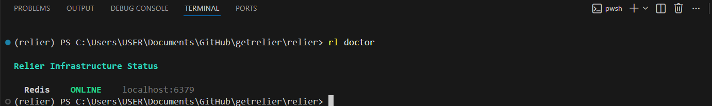
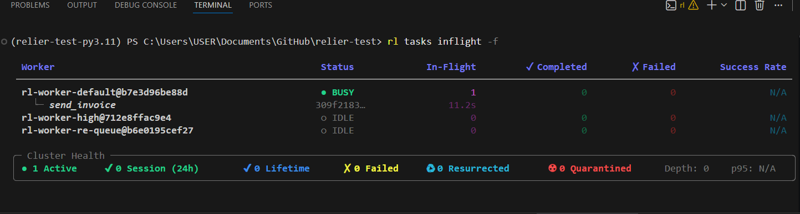
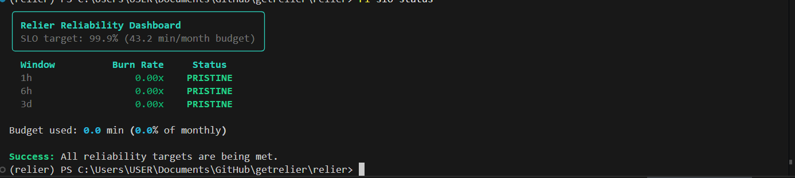

# Quickstart

Get Relier running in under 5 minutes.

---

## 1. Install Relier

```bash
pip install relier
```

!!! note "pip install vs. contributing from source"
    This guide covers the **pip install** path, which is the right choice for adding Relier to your own project. If you're contributing to Relier itself, clone the repo and run `make setup` instead. The `make worker` / `make dev` shortcuts only exist in the cloned repo; pip users start workers with the `celery` command directly (shown in [Step 6](#6-start-the-worker)).

## 2. Start Redis

Relier needs Redis with persistence enabled. The quickest way locally is Docker:

=== "macOS / Linux"

    ```bash
    docker run -d --name relier-redis \
      -p 6379:6379 \
      redis:7-alpine \
      redis-server --appendonly yes --appendfsync everysec
    ```

=== "Windows (PowerShell)"

    ```powershell
    docker run -d --name relier-redis -p 6379:6379 redis:7-alpine redis-server --appendonly yes --appendfsync everysec
    ```

    PowerShell does not support the `\` line-continuation used in Bash. Run the command as a single line.

!!! note "Why persistence?"
    The `--appendonly yes` flag enables Redis AOF persistence. Without it, a Redis restart drops every heartbeat and payload Relier has stored, breaking the zero-job-loss guarantee. See [Deployment](deployment.md) for production Redis setup.

## 3. Configure Relier

Create a `.env` file in your project root:

```bash
RELIER_REDIS_URL=redis://localhost:6379/0
```

That's the only required setting. Everything else has sensible defaults.

## 4. Define your first reliable task

```python
# tasks.py
import asyncio
from relier import rl_task

@rl_task(
    queue="default",
    idempotent=True,           # same invoice_id → never runs twice
    soft_timeout=25,           # cleanup hook fires at 25s
    hard_timeout=30,           # forcefully terminates runaway execution at 30s
)
async def send_invoice(invoice_id: str) -> dict:
    """Send an invoice: safe to retry, never double-charges."""
    await asyncio.sleep(1)   # ← replace with your actual work: Stripe, DB write, email
    return {"charged": True, "invoice_id": invoice_id}
```

!!! tip "This example runs immediately: no external services needed"
    `asyncio.sleep(1)` is a stand-in. Replace it with your actual logic once the worker is running. For ready-to-copy real-world shapes (Stripe, database writes, HTTP calls) see the [Integration Recipes](integrations.md).

!!! tip "New to async?"
    Relier tasks are `async def` functions. If your existing Celery tasks are regular `def` functions, Relier supports those too: just drop the `async` keyword. The async bridge is handled for you either way.

### Returning results

Tasks return values like any Python function:

```python
async def send_invoice(invoice_id: str) -> dict:
    ...
    return {"charged": True, "invoice_id": invoice_id}
```

When `idempotent=True`, Relier automatically caches that return value. If the same `invoice_id` arrives again (retry, webhook re-delivery, duplicate dispatch), the cached result is returned immediately without re-running the function.

**Most users never need to manage results manually.** Manual result control with `idempotency_lock` is only needed when the key Relier would derive from arguments isn't the right one, for example, when a webhook `event_id` is more stable than the full payload hash. See [Patterns Cookbook → Pattern 2](patterns.md#pattern-2).

## 5. Dispatch tasks

Relier has two dispatch methods on every `@rl_task`. Pick the one that
matches your call site.

```python
# FastAPI / Starlette / async Django use apush
from fastapi import FastAPI
from tasks import send_invoice

app = FastAPI()

@app.post("/invoices/{invoice_id}/send")
async def dispatch_invoice(invoice_id: str):
    await send_invoice.apush(invoice_id)   # async dispatch
    return {"status": "queued"}
```

```python
# Flask / classic Django / scripts / management commands use push
from flask import Flask
from tasks import send_invoice

app = Flask(__name__)

@app.post("/invoices/<invoice_id>/send")
def dispatch_invoice(invoice_id):
    send_invoice.push(invoice_id)           # sync dispatch
    return {"status": "queued"}, 202
```

Both run the same reliability stack, admission control, schema envelope, OTel
context and both are fire-and-forget (they return as soon as the broker has
the task).

!!! warning "Don't call `.delay()` or `.apply_async()` on a `@rl_task`"
    Those are Celery's native dispatch methods. They bypass Relier's admission
    control and skip the signed envelope, so the worker accepts the payload as
    a legacy unsigned message. **Always use `apush` (async) or `push` (sync).**
    See [API reference → Dispatch methods](api-reference.md#dispatch-methods-apush-push-delay).

## 6. Start the worker

### Installed via pip (your own project)

Open two terminals. Start these in the directory that contains your `tasks.py`.

**Terminal 1: Celery worker:**

=== "macOS / Linux"

    ```bash
    celery -A relier.tasks.app worker -l info -Q high_priority,default,low_priority,re-queue --include=tasks
    ```

=== "Windows (PowerShell)"

    ```bash
    celery -A relier.tasks.app worker -l info -Q high_priority,default,low_priority,re-queue --include=tasks --pool=solo
    ```

    `--pool=solo` is required on Windows. Celery's default `prefork` pool uses named pipes for IPC that are unreliable under Windows' `spawn`-based multiprocessing, causing workers to crash with `OSError: [WinError 6]` on task receipt. `solo` runs everything in the main process and works correctly with Relier's async task execution.

**Terminal 2: Phoenix resurrector:**

```bash
rl run-resurrector
```

!!! note "Why two processes?"
    The Celery worker executes tasks. The Phoenix resurrector is a separate recovery service responsible for heartbeat monitoring, orphan detection, and re-queuing tasks after a worker crash. Keeping recovery isolated from workers means that a cascading worker failure cannot disable the recovery logic at the same time; the resurrector keeps running and draining the orphan backlog even as workers restart.

!!! warning "Workers must import your task modules"
    **Relier wraps Celery's worker entry system, it does not replace it.** You must provide a module that imports your task definitions so Celery registers them at startup.

    The simplest way is `--include`:

    - Tasks in `tasks.py` → `--include=tasks`
    - Tasks in `myapp/tasks.py` → `--include=myapp.tasks`

    Without this, the worker boots silently but logs `Received unregistered task of type '...'` when a task arrives and discards it. This is the most common first-time setup issue.

    **For production**, create a dedicated entry-point module instead:

    ```python
    # worker_app.py
    from relier.tasks.app import celery_app  # Relier's configured Celery app
    import tasks                              # registers your @rl_task functions
    import myapp.tasks                        # add more modules as needed
    ```

    Then run: `celery -A worker_app worker -l info -Q ...` (no `--include` needed).

    What `celery -A relier.tasks.app` means: *"start a worker using Relier's Celery app"*. Relier's app is what wires up Phoenix, DLQ, idempotency, and the async bridge. Do not substitute a custom `Celery(...)` instance; Relier's guarantees only work through its own app.

!!! warning "Module name, not file path"
    Celery's `-A` flag takes a **Python module name**, not a file path:

    ```bash
    celery -A worker_app worker ...   # ✓ module name
    celery -A worker_app.py worker ... # ✗ file path: raises "module not found"
    ```

!!! note "Avoid running `python tasks.py` directly"
    If you execute `python tasks.py` as a script, Celery names your tasks `__main__.send_invoice` instead of `tasks.send_invoice`. The worker won't recognise the name and will reject the task. Always route tasks through the Celery worker command above.

### Cloned from source (contributing / dev)

`make worker` starts the Relier infrastructure (heartbeats, Phoenix, graceful shutdown) against the library itself; there are no user task modules to import in this context. It runs the same `celery -A relier.tasks.app worker` command without `--include`, which is correct for the repo's own use.

```bash
make worker         # terminal 1: Celery worker
make resurrector    # terminal 2: Phoenix resurrector
```

Or the full Docker dev stack (Redis + workers + resurrector + OTel/Grafana):

```bash
make dev
```

Production HA stack (Sentinel + replicas + backup sidecar):

```bash
export REDIS_PASSWORD=...
export SENTINEL_PASSWORD=...
make prod
```

All deployment options are documented in [Deployment](deployment.md).

## 7. Verify everything is working

```bash
# Check that Redis and Docker are healthy
rl doctor

# See what's running right now
rl tasks inflight

# Check your SLO burn rate
rl slo status
```

**`rl doctor`** — connectivity and configuration check:



**`rl tasks inflight`** — live view of workers and in-flight tasks:



**`rl slo status`** — SLO burn rate across 1h / 6h / 3d windows:



---

## What just happened?

When you called `await send_invoice.apush(invoice_id)`:

1. **Admission check**: Relier verified the cluster isn't overloaded.
2. **Schema wrapping**: the payload was signed with a checksum and versioned.
3. **Dispatch**: sent to the Redis broker with the original `invoice_id`.

When a Celery worker picked it up:

1. **Checksum verified**: payload integrity confirmed before execution.
2. **Idempotency claimed**: only one worker can run this invoice_id at a time.
3. **Heartbeat registered**: Phoenix starts watching this task.
4. **Your function ran**: `send_invoice("INV-123")` executed.
5. **Result cached**: if this exact invoice_id is retried, Relier returns the cached result without re-running.
6. **Heartbeat cleared**: Phoenix knows the task completed cleanly.

---

## What happens when a worker dies?

With your worker and resurrector both running, dispatch a task and then kill the
worker process (`Ctrl+C` or `kill <pid>`). Within about 12 seconds you'll see
the resurrector log:

<div class="rl-terminal">
<div class="rl-terminal-bar">rl run-resurrector</div>
<pre>
<span class="rl-p">PHOENIX</span> Resurrector initializing...
<span class="rl-dim">[23:17:12]</span> <span class="rl-ok">INFO    </span> Initialising loop-local Relier Redis connection pool. <span class="rl-dim">[loop=2239067885072 → redis://***@localhost:6379/0]</span>
           <span class="rl-ok">INFO    </span> Redis connectivity verified.
<span class="rl-dim">[23:21:05]</span> <span class="rl-warn">WARNING </span> Worker death detected; replaying orphaned task.
                    <span class="rl-key">task_id</span>=<span class="rl-info">'1cb7407c-88ae-47b1-b3f5-83ad36d31116'</span>  <span class="rl-key">task_name</span>=<span class="rl-info">'tasks.send_invoice'</span>  <span class="rl-key">attempt</span>=<span class="rl-info">1</span>  <span class="rl-key">max_attempts</span>=<span class="rl-info">5</span>
                    <span class="rl-key">ghost_worker</span>=<span class="rl-info">'rl-worker-default@b7e3d96be88d'</span>  <span class="rl-key">queue</span>=<span class="rl-info">'default'</span>  <span class="rl-key">has_checkpoint</span>=<span class="rl-info">False</span>
           <span class="rl-ok">INFO    </span> Acquired resurrection lease
                    <span class="rl-key">task_id</span>=<span class="rl-info">'1cb7407c-88ae-47b1-b3f5-83ad36d31116'</span>  <span class="rl-key">lease_key</span>=<span class="rl-info">'rl:lease:{1cb7407c-88ae-47b1-b3f5-83ad36d31116}'</span>  <span class="rl-key">lease_ttl</span>=<span class="rl-info">180</span>
           <span class="rl-ok">INFO    </span> Submitting resurrected task to broker.
                    <span class="rl-key">task_id</span>=<span class="rl-info">'1cb7407c-88ae-47b1-b3f5-83ad36d31116'</span>  <span class="rl-key">task_name</span>=<span class="rl-info">'tasks.send_invoice'</span>  <span class="rl-key">queue</span>=<span class="rl-info">'default'</span>
           <span class="rl-ok">INFO    </span> Phoenix recovered 1 orphaned task(s) onto healthy workers
                    <span class="rl-key">resurrected</span>=<span class="rl-info">1</span>  <span class="rl-key">monitored</span>=<span class="rl-info">0</span>  <span class="rl-key">duration_ms</span>=<span class="rl-info">62</span>
           <span class="rl-ok">INFO    </span> Resurrected task successfully re-queued.
                    <span class="rl-key">task_id</span>=<span class="rl-info">'1cb7407c-88ae-47b1-b3f5-83ad36d31116'</span>  <span class="rl-key">task_name</span>=<span class="rl-info">'tasks.send_invoice'</span>
</pre>
</div>

The task completes on a healthy worker. No data loss, no duplicate execution
(idempotency blocks the re-run from charging twice), no manual intervention.

That guarantee holds whether the worker was killed by OOM, a deploy `SIGTERM`, a
kernel panic, or a `kill -9`. Phoenix detects the missed heartbeat and acts.

To verify the full failure surface (network partitions, load spikes, payload
corruption), the repo ships a first-party chaos suite:

!!! info "Chaos requires the Docker dev stack"
    `rl chaos` commands use `docker kill` to terminate worker containers. They only work when the stack is running via `make dev` in the cloned repo. `pip install` users can still run scenarios that don't need Docker kills (`load-spike`, `slow-task`, `task-corrupt`); see the [Chaos Guide](chaos-guide.md) for the breakdown.

```bash
rl chaos worker-kill --seed --watch --watch-duration 60
```

Relier's production runtime ships entirely via `pip install`. The chaos suite is
part of the development harness for contributors and teams that want to stress-test
their own cluster. See the [Chaos Guide](chaos-guide.md) for the full setup.

---

## Next steps

- **Never used Celery before?** [Celery Primer](celery-primer.md): the basics in
  five minutes.
- **[Core Concepts](concepts.md)**: understand *why* Relier works the way it does.
- **[Integration Recipes](integrations.md)**: FastAPI, Flask, Django, scripts.
- **[Patterns Cookbook](patterns.md)**: copy-paste shapes for common cases, including
  manual idempotency control with `idempotency_lock` when you need a custom key.
- **[Troubleshooting & FAQ](troubleshooting.md)**: first place to look when
  something breaks.
- **[API Reference](api-reference.md)**: all `@rl_task` parameters explained.
- **[Configuration](configuration.md)**: tune timeouts, pool sizes, admission
  control, and more.
